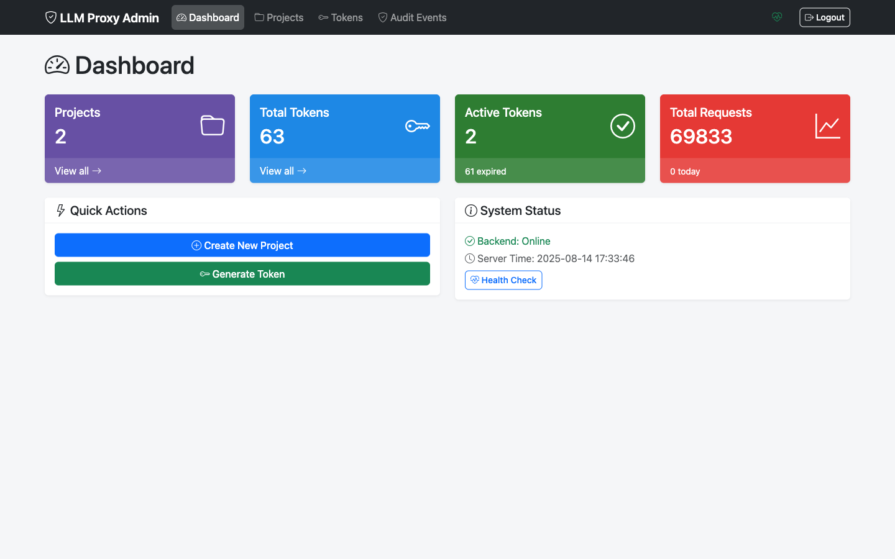

# Admin UI

The LLM Proxy Admin UI provides a web-based interface for managing projects, tokens, and viewing audit logs. This guide covers all Admin UI features and workflows.

## Overview

The Admin UI allows you to:

- **Project Management**: Create, edit, activate/deactivate projects
- **Token Management**: Generate, view, revoke withering tokens
- **Audit Logs**: Browse and search security audit events
- **Cache Monitoring**: View per-token cache statistics

## Accessing the Admin UI

### Default Setup (Integrated)

When running the proxy server, the Admin UI is available at:

```
http://localhost:8080/admin/
```

### Separate Admin Service

For Docker Compose deployments, run the admin as a separate service:

```bash
docker compose up admin
# Access at http://localhost:8081/
```

### Authentication

The Admin UI uses the same `MANAGEMENT_TOKEN` as the API. Enter your management token when prompted.


## Features

### Dashboard

The dashboard provides an overview of your LLM Proxy deployment:

- Active projects count
- Active tokens count
- Recent activity summary



### Project Management

Manage API access through projects. Each project has its own OpenAI API key and can have multiple tokens.

**Key features**:
- Create new projects with API keys
- Edit project name and API key
- Activate/deactivate projects
- View project details and associated tokens

See [Project Management](projects.md) for detailed workflows.

### Token Management

Generate and manage withering tokens for API access.

**Key features**:
- Generate tokens with custom duration and limits
- View token details and usage statistics
- Revoke individual tokens
- Bulk revoke all tokens for a project

See [Token Management](tokens.md) for detailed workflows.

### Audit Logs

Browse security audit events for compliance and debugging.

**Audited events include**:
- Token creation and revocation
- Project changes
- Authentication attempts
- API access events


## Quick Start Guide

1. **Access the Admin UI** at `http://localhost:8080/admin/`
2. **Log in** with your management token
3. **Create a project** with your OpenAI API key
4. **Generate a token** for API access
5. **Use the token** to proxy requests

See [Admin Quickstart](quickstart.md) for step-by-step instructions.

## Screenshots

For a visual tour of all Admin UI screens, see [Screenshots](screens.md).

## Navigation

| Page | Description |
|------|-------------|
| [Quickstart](quickstart.md) | Get started with the Admin UI |
| [Project Management](projects.md) | Create and manage projects |
| [Token Management](tokens.md) | Generate and manage tokens |
| [Screenshots](screens.md) | Visual tour of all screens |

## Related Documentation

- [Token Management Guide](../token-management.md) - Complete token lifecycle documentation
- [Configuration Reference](../configuration.md) - Admin UI configuration options
- [Security Best Practices](../security.md) - Audit logging and security
