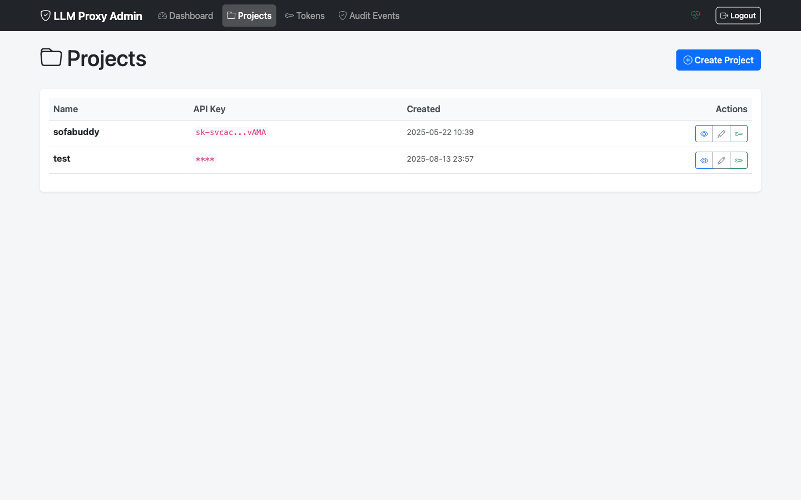
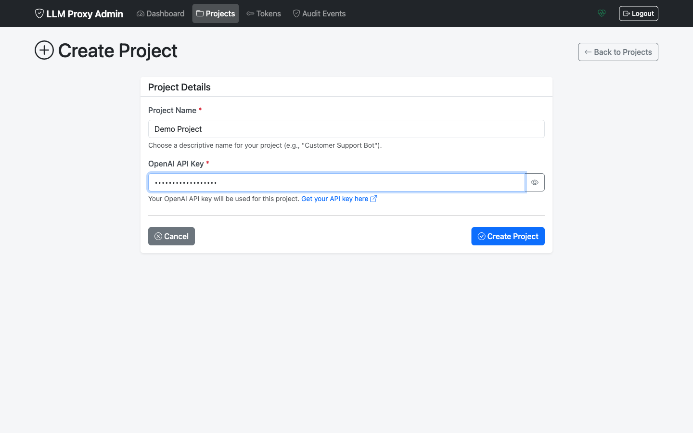
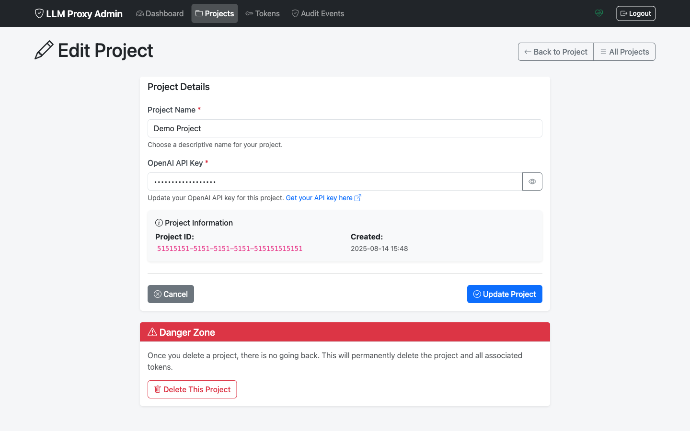

# Project Management

This guide covers managing projects through the Admin UI.

## Overview

Projects are the foundation of access control in LLM Proxy. Each project:

- Has a unique OpenAI API key
- Can have multiple tokens
- Can be activated or deactivated
- Maintains an audit trail

## Viewing Projects

### Projects List

Navigate to **Projects** in the sidebar to see all projects.



The list shows:
- **Name**: Project identifier
- **Status**: Active or Inactive
- **Created**: Creation date
- **Tokens**: Number of associated tokens
- **Actions**: Edit, activate/deactivate

### Filtering Projects

Use the filter options to find specific projects:
- Search by name
- Filter by status (active/inactive)

## Creating a Project

### Step 1: Open Create Dialog

Click the **New Project** button on the Projects page.



### Step 2: Enter Project Details

Fill in the required information:

| Field | Required | Description |
|-------|----------|-------------|
| **Name** | Yes | A descriptive name for the project |
| **OpenAI API Key** | Yes | Your OpenAI API key (sk-...) |


### Step 3: Submit

Click **Create Project**. The project is created as **Active** by default.

### Best Practices for Project Organization

- Use descriptive names (e.g., "Production API", "Development Team")
- Create separate projects for different environments
- Create separate projects for different API key access levels

## Viewing Project Details

Click on a project name to view its details.



The detail view shows:

- **Project Information**
  - ID
  - Name
  - Status
  - Created date

- **API Key** (partially masked for security)

- **Tokens**
  - Total count
  - Active count
  - Recent tokens list

- **Actions**
  - Edit project
  - Generate token
  - Activate/Deactivate
  - Bulk revoke tokens

## Editing a Project

### Update Name or API Key

1. Navigate to the project detail page
2. Click **Edit Project**
3. Modify the name or API key
4. Click **Save Changes**

### Update API Key

When rotating your OpenAI API key:

1. Edit the project
2. Enter the new API key
3. Save changes

> **Note**: Existing tokens continue to work with the new API key. No token regeneration needed.

## Activating and Deactivating Projects

### Deactivate a Project

Deactivating a project:
- Blocks all API requests using project tokens
- Prevents new token generation
- Does NOT revoke existing tokens

To deactivate:
1. Go to project details
2. Click **Deactivate Project**
3. Confirm the action

Use cases:
- Temporarily suspend access
- Rotate API keys safely
- Investigate security concerns

### Reactivate a Project

To reactivate:
1. Go to project details
2. Click **Activate Project**
3. Confirm the action

Existing tokens become usable again (if not expired or revoked).

## Bulk Token Operations

### Revoke All Project Tokens

To revoke all tokens for a project:

1. Go to project details
2. Click **Revoke All Tokens**
3. Confirm the action

This is useful when:
- Rotating API keys with full token reset
- Security incident response
- Project decommissioning

> **Warning**: This action cannot be undone. All tokens will be immediately unusable.

## Project Lifecycle

```
┌─────────────┐     ┌─────────────┐     ┌─────────────┐
│   Create    │────>│   Active    │<───>│  Inactive   │
│             │     │             │     │             │
└─────────────┘     └─────────────┘     └─────────────┘
                          │
                          │ Cannot Delete
                          │ (405 Error)
                          ▼
                    ┌─────────────┐
                    │  Preserved  │
                    │ for Audit   │
                    └─────────────┘
```

### Why Projects Cannot Be Deleted

Projects cannot be deleted (returns 405 Method Not Allowed) for:

1. **Audit Trail Integrity**: Maintains complete history
2. **Data Safety**: Prevents accidental loss
3. **Token History**: Preserves usage records
4. **Reactivation Option**: Allows recovery

Instead of deletion:
1. Deactivate the project
2. Revoke all tokens
3. The project remains but is fully disabled

## Common Workflows

### Set Up a New API Integration

1. Create a new project with descriptive name
2. Enter your OpenAI API key
3. Generate a token with appropriate duration
4. Provide token to the integration

### Rotate API Key

1. Obtain new API key from OpenAI
2. Edit the project
3. Update the API key
4. Save changes

No token changes needed - existing tokens work with new key.

### Decommission a Project

1. Deactivate the project
2. Revoke all tokens
3. Confirm all integrations have migrated
4. Project remains inactive for audit

### Respond to Security Incident

If a project's API key is compromised:

1. **Immediately** deactivate the project
2. Revoke all project tokens
3. Rotate the OpenAI API key in OpenAI dashboard
4. Update project with new API key
5. Reactivate project
6. Generate new tokens for legitimate users

## Troubleshooting

### Cannot Create Project

**Error**: "Invalid API key format"

**Solution**: Ensure the API key starts with `sk-` and is complete.

### Cannot Generate Tokens

**Error**: "Cannot generate tokens for inactive project"

**Solution**: Activate the project first.

### Project Status Shows Inactive

**Check**:
1. Was the project recently deactivated?
2. View the audit log for status changes
3. Reactivate if needed

## Related Documentation

- [Token Management](tokens.md)
- [Token Management Guide](../token-management.md)
- [Security Best Practices](../security.md)
