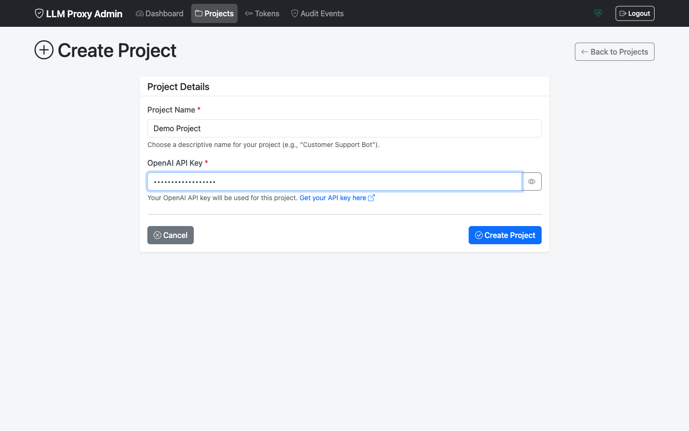
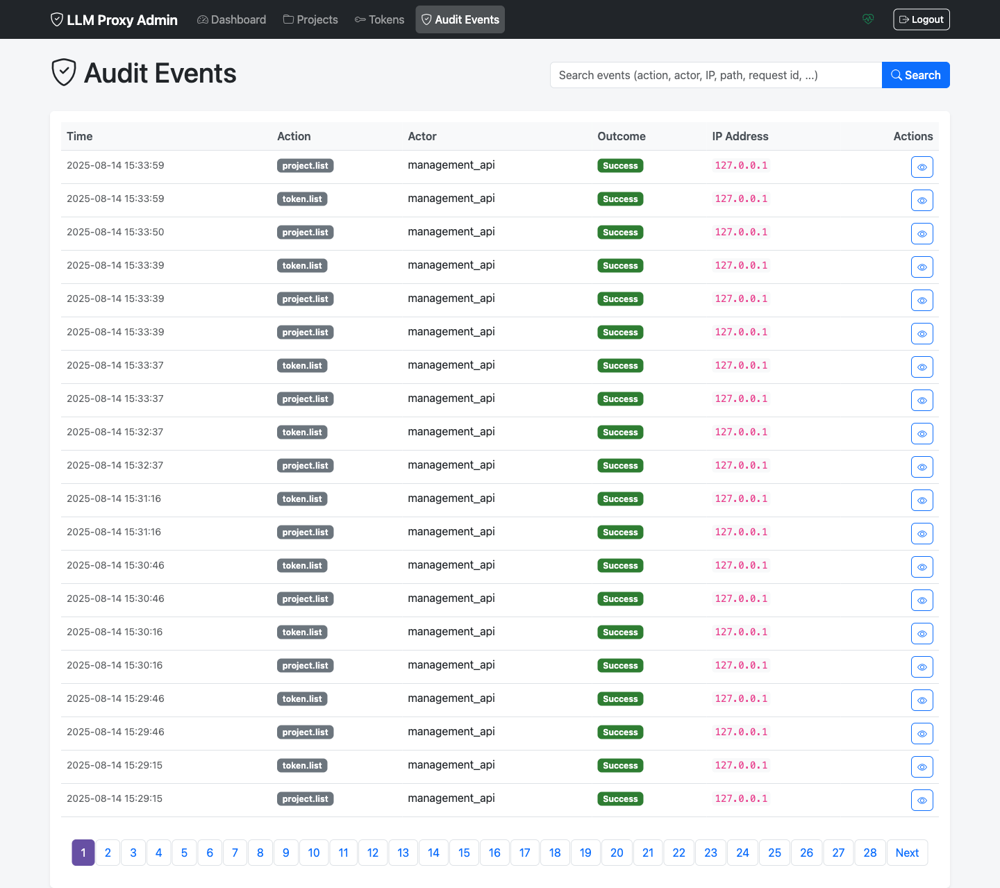

# Admin UI Screenshots

This page provides a visual tour of all Admin UI screens.

## Authentication

### Login

The login screen prompts for your management token.

**To log in:**
1. Enter your `MANAGEMENT_TOKEN`
2. Click **Login**

## Dashboard

### Main Dashboard

The dashboard shows an overview of your LLM Proxy deployment.

**Dashboard shows:**
- Total projects count
- Active tokens count
- Recent activity summary
- Quick action buttons

## Projects

### Projects List

View all projects with their status and quick actions.

**Features:**
- Search and filter projects
- See active/inactive status
- Quick access to project actions

### Create Project

Create a new project with API key.

**Required fields:**
- Project name
- OpenAI API key

### Create Project (Filled)

Example of a filled project creation form.

### Project Details

View detailed information about a project.

**Shows:**
- Project ID and name
- API key (partially masked)
- Status (Active/Inactive)
- Associated tokens
- Quick actions (Edit, Generate Token, Activate/Deactivate)

## Tokens

### Tokens List

View all tokens with filtering options.

**Columns:**
- Token ID (truncated)
- Project
- Status
- Created/Expires dates
- Usage statistics
- Actions

### Generate Token

Generate a new withering token.

**Configuration:**
- Select project
- Set duration (hours)
- Set max requests (optional)

### Token Created

Confirmation showing the newly created token.

**Important:** Copy the token immediately! It's only shown once.

## Audit

### Audit Log

Browse security audit events.

**Shows:**
- Event timestamp
- Action type
- Actor
- Result (success/failure)
- Associated project/token

### Audit Detail

View detailed information about a specific audit event.

**Details include:**
- Full event metadata
- Request information
- Associated resources
- Client IP and user agent

## Related Documentation

- [Admin UI Overview](index.md)
- [Project Management](projects.md)
- [Token Management](tokens.md)
- [Admin Quickstart](quickstart.md)
