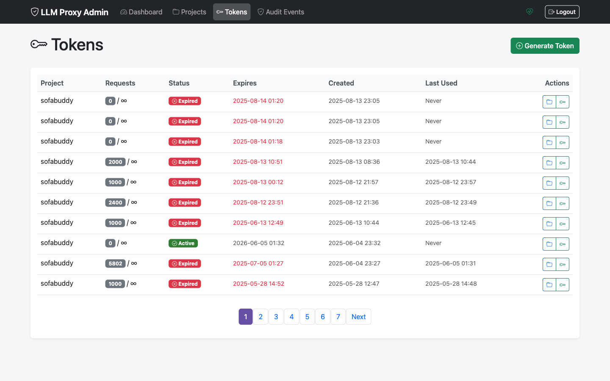
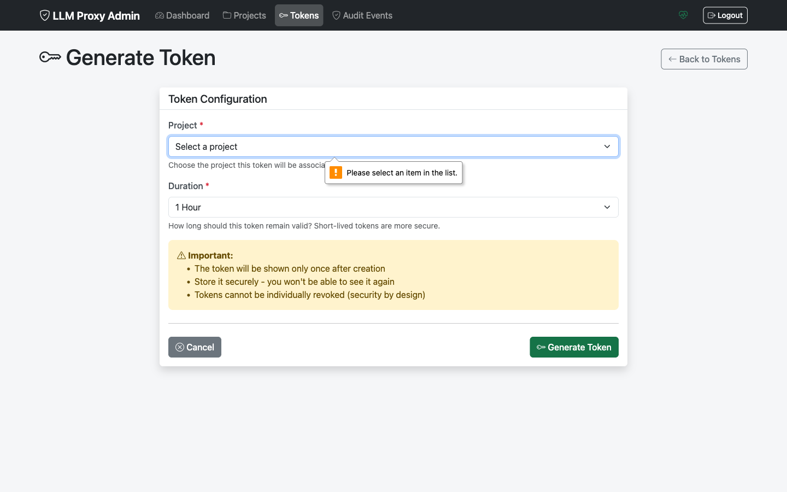

# Token Management

This guide covers managing withering tokens through the Admin UI.

## Overview

Tokens provide time-limited access to the proxy. The Admin UI allows you to:

- Generate new tokens with custom settings
- View token details and usage
- Revoke tokens individually or in bulk
- Monitor cache statistics per token

## Viewing Tokens

### Tokens List

Navigate to **Tokens** in the sidebar or access tokens from a project's detail page.



The tokens list shows:

| Column | Description |
|--------|-------------|
| **ID** | Truncated token identifier |
| **Project** | Parent project name |
| **Status** | Active, Expired, or Revoked |
| **Created** | Creation timestamp |
| **Expires** | Expiration timestamp |
| **Requests** | Usage count (used/limit) |
| **Cached** | Cache hit count |
| **Actions** | View, Revoke |

### Token Status Indicators

| Status | Indicator | Meaning |
|--------|-----------|---------|
| **Active** | 🟢 Green | Token is valid and usable |
| **Expired** | 🟠 Orange | Token has passed expiration time |
| **Revoked** | 🔴 Red | Token was manually deactivated |
| **Rate Limited** | 🟡 Yellow | Request limit reached |

### Filtering Tokens

Filter the token list by:
- **Project**: Show tokens for a specific project
- **Status**: Active, Expired, Revoked, or All
- **Search**: Find by token ID

## Generating a Token

### Step 1: Access Token Generation

Either:
- Click **Generate Token** from the Tokens page
- Click **Generate Token** from a project's detail page


### Step 2: Configure Token Settings

| Setting | Required | Description |
|---------|----------|-------------|
| **Project** | Yes | Select the parent project |
| **Duration (hours)** | Yes | Token lifetime (default: 24) |
| **Max Requests** | No | Request limit (0 = unlimited) |

### Duration Recommendations

| Use Case | Duration |
|----------|----------|
| One-time testing | 1-4 hours |
| Development session | 24 hours |
| CI/CD pipeline | 4-8 hours |
| Weekly batch job | 168 hours (7 days) |
| Long-running service | 720 hours (30 days) |

### Step 3: Generate

Click **Generate Token**. The new token is displayed.



> **Important**: Copy the token immediately! It is only shown once.

### Token Format

Generated tokens follow this format:
```
sk-wt-xxxxxxxxxxxxxxxxxxxxxxxxxxxx
```

- `sk-wt-` prefix indicates a withering token
- Followed by random alphanumeric characters

## Viewing Token Details

Click on a token ID to view its details:

- **Basic Information**
  - Token ID
  - Project
  - Created date
  - Expiration date
  - Status

- **Usage Statistics**
  - Request count
  - Request limit
  - Cache hit count
  - Remaining requests

- **Timestamps**
  - Created at
  - Last used at
  - Expires at

## Token Usage Metrics

The Admin UI displays key usage metrics:

| Metric | Description |
|--------|-------------|
| **REQUESTS** | Total requests made with this token |
| **CACHED** | Requests served from cache |
| **UPSTREAM** | Requests forwarded to OpenAI |
| **LIMIT** | Max requests (∞ if unlimited) |
| **REMAINING** | Requests until limit reached |

### Understanding Cache Statistics

- **High cache hit rate**: Good! Requests are being served quickly from cache
- **Low cache hit rate**: Normal for unique prompts; each unique request creates a separate cache entry

## Revoking Tokens

### Revoke Individual Token

1. Navigate to the token in the list
2. Click the **Revoke** action button
3. Confirm the revocation

The token immediately becomes unusable.

### Revoke from Project Page

1. Go to the project detail page
2. Find the token in the tokens list
3. Click **Revoke**

### Bulk Revocation

To revoke all tokens for a project:

1. Go to the project detail page
2. Click **Revoke All Tokens**
3. Confirm the action

> **Warning**: Bulk revocation affects all tokens immediately and cannot be undone.

### When to Revoke Tokens

- Token is compromised
- User/service no longer needs access
- Rotating all credentials
- Responding to security incidents
- End of temporary access period

## Token States Explained

### Active Tokens

- Within expiration time
- Under request limit
- Parent project is active
- Not manually revoked

### Expired Tokens

- Expiration time has passed
- Cannot be reactivated
- Generate new token instead

### Revoked Tokens

- Manually deactivated via Admin UI or API
- Can potentially be reactivated via API (use PATCH)
- Shown in list for audit purposes

### Rate Limited Tokens

- Active but reached max_requests limit
- Cannot be used until limit is reset
- Generate new token or increase limit

## Managing Token Lists

### Sort Options

Click column headers to sort by:
- Created date
- Expiration date
- Request count
- Status

### Bulk Actions

Select multiple tokens to:
- Export token list (CSV)
- Bulk revoke (with confirmation)

## Common Workflows

### Generate Short-Lived Token for Testing

1. Go to project
2. Generate Token
3. Set duration to 1-4 hours
4. Copy token for testing
5. Token auto-expires

### Set Up Service Account Token

1. Generate token with longer duration (168-720 hours)
2. Set appropriate request limit
3. Store securely in service configuration
4. Monitor usage in Admin UI

### Rotate Tokens

1. Generate new token before old expires
2. Update application with new token
3. Verify new token works
4. Revoke old token

### Emergency Token Revocation

If a token is compromised:

1. **Immediately** revoke the specific token
2. Check audit logs for unauthorized usage
3. Generate replacement token
4. Update legitimate users

## Monitoring Best Practices

### Regular Checks

- Review active tokens weekly
- Check for unused tokens (no recent requests)
- Monitor tokens approaching expiration
- Review tokens near request limits

### Audit Log Review

Check audit logs for:
- Unexpected token creation
- Unusual usage patterns
- Failed authentication attempts
- Bulk revocation events

## Troubleshooting

### Token Not Working

**Check**:
1. Is token status Active?
2. Has token expired?
3. Has request limit been reached?
4. Is parent project active?

**Solution**: Generate a new token if any check fails.

### Cannot Generate Token

**Error**: "Cannot generate tokens for inactive project"

**Solution**: Activate the project first, then generate token.

### Token Expired Too Soon

**Check**: The duration setting at generation time.

**Prevention**: Use longer duration for services that need persistent access.

### High Request Count

**Monitor**: Compare request_count to max_requests.

**Action**: Generate new token with higher limit if needed.

## Related Documentation

- [Project Management](projects.md)
- [Token Management Guide](../token-management.md)
- [Security Best Practices](../security.md)
- [Troubleshooting Guide](../troubleshooting.md)
