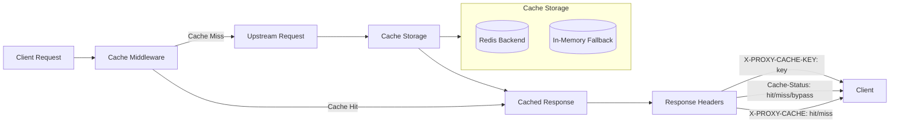
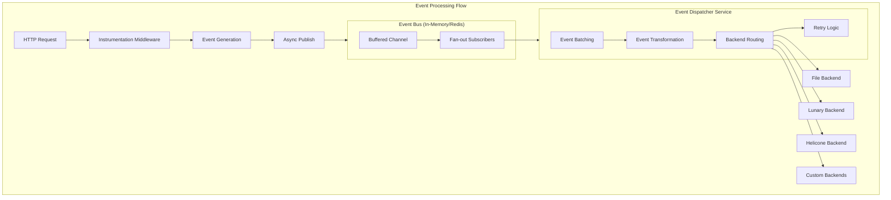
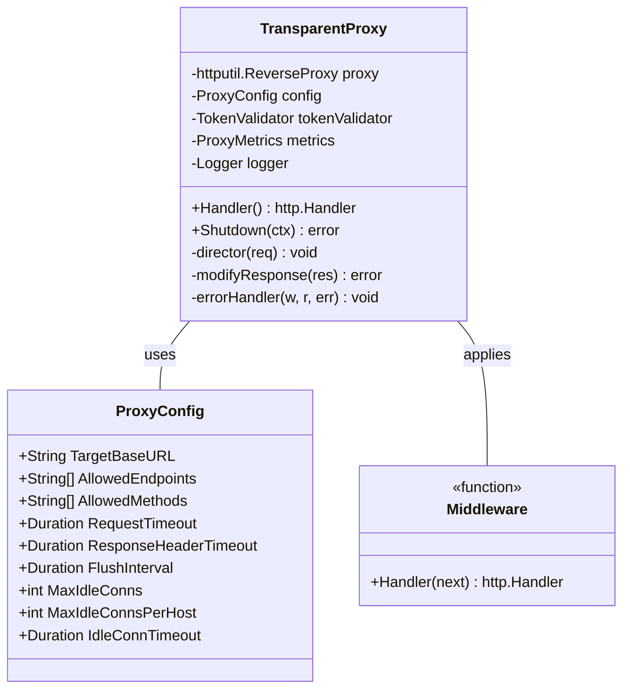
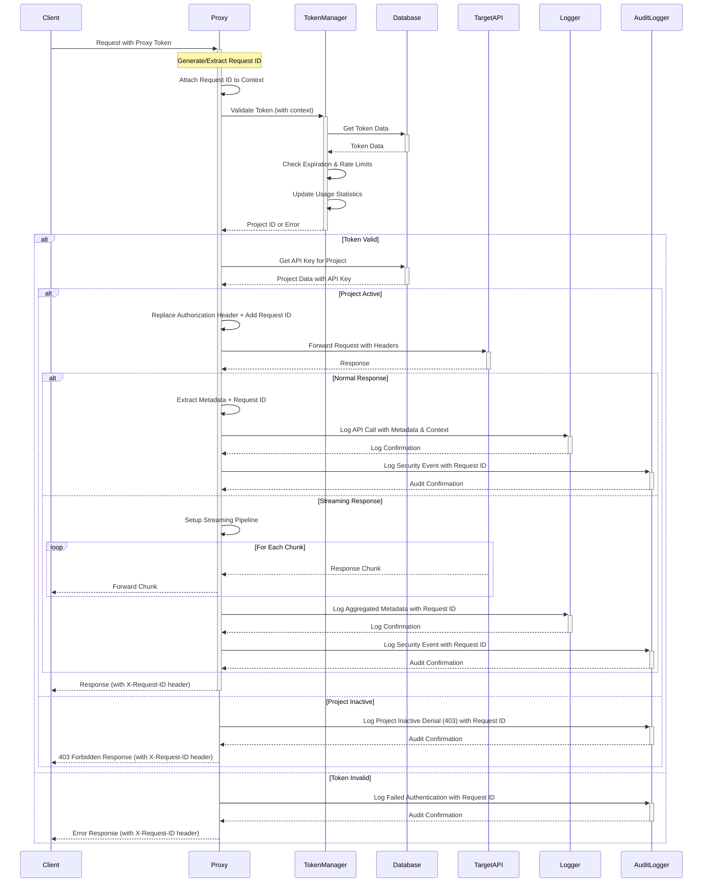
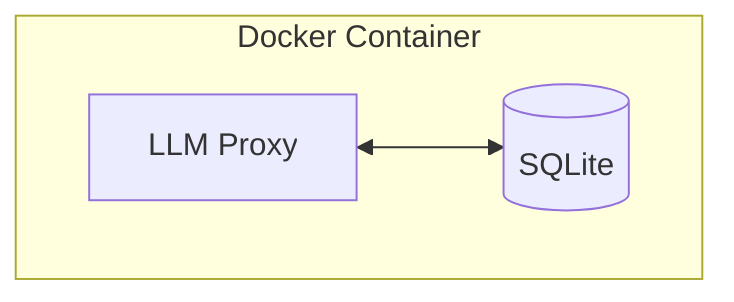
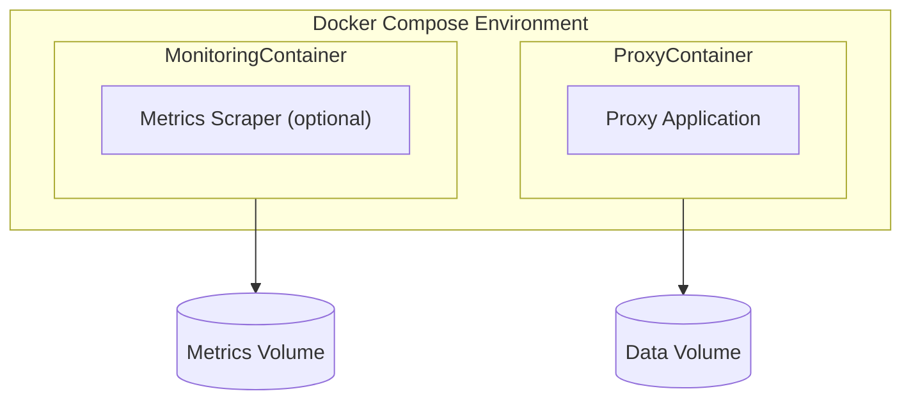
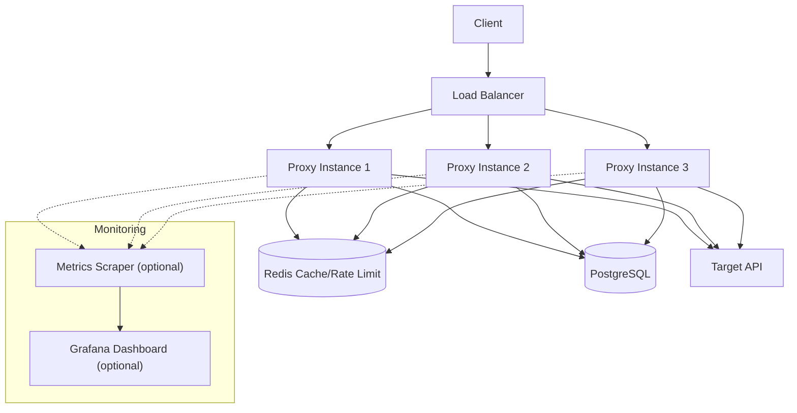
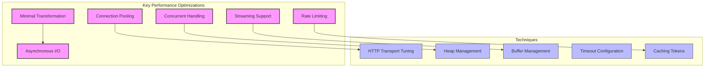

# LLM Proxy Architecture (Generic API Proxy)

> **Note:** While this document describes the proxy in the context of OpenAI, the architecture is generic and can be adapted to any API requiring secure, short-lived tokens and transparent proxying. OpenAI serves as a case study for this implementation.

This document describes the architecture of the LLM Proxy, explaining the main components, their interactions, and design decisions.

## Overview

The LLM Proxy is a transparent proxy server for API requests, providing token management, authentication, and usage tracking. It acts as an intermediary between client applications and API providers with minimal overhead and maximum transparency.

## Key Design Principles

1. **Minimal Request/Response Transformation**
   - Authorization header replacement only
   - All other request/response data passed through unchanged
   - No SDK or API-specific client dependencies

2. **Performance Optimization**
   - Minimal latency overhead
   - Efficient streaming response handling
   - Connection pooling for HTTP clients
   - Memory efficiency for large payloads

3. **Robust Request Handling**
   - Support for all HTTP methods (GET, POST, PUT, DELETE, etc.)
   - Handling of various content types (JSON, form data, binary)
   - Support for streaming responses (SSE)
   - Proper header preservation and propagation

4. **Flexible Configuration**
   - Configurable target API (not hardcoded to OpenAI)
   - Allowlist/whitelist for endpoints and methods
   - Configurable authentication transformation
   - Support for different target APIs

## System Architecture

```mermaid
flowchart LR
    Clients["Clients"] --> Proxy
    Admin["Admin"] --> Proxy
    
    subgraph Proxy["LLM Proxy Server"]
        AuthSystem["Auth System"] --> TokenManager["Token Manager"]
        TokenManager --> CacheLayer["Cache Layer"]
        CacheLayer --> ReverseProxy["Reverse Proxy"]
        ReverseProxy --> EventBus["Event Bus"]
        EventBus --> EventDispatcher["Event Dispatcher"]
        ReverseProxy <--> LoggingSystem["Logging System"]
        ReverseProxy <--> AuditLogger["Audit Logger"]
        AdminUI["Admin UI"] --> TokenManager
        DB[("Database")] <--> TokenManager
        DB <--> AuditLogger
        AuditLogger --> AuditFile[("Audit Log File")]
    end
    
    subgraph EventSystem["Async Event System"]
        EventBus
        EventDispatcher --> FilePlugin["File Backend"]
        EventDispatcher --> LunaryPlugin["Lunary Backend"]
        EventDispatcher --> HeliconePlugin["Helicone Backend"]
        EventDispatcher --> CustomPlugin["Custom Backends"]
    end
    
    subgraph Storage["Data Storage"]
        DB
        AuditFile
        RedisCache[("Redis Cache")]
        InMemoryCache[("In-Memory Cache")]
        EventLogs[("Event Logs")]
    end
    
    CacheLayer <--> RedisCache
    CacheLayer <--> InMemoryCache
    EventBus -.-> RedisCache
    EventDispatcher --> EventLogs
    
    Proxy --> API["Target API"]
 ```

### Proxy Component Architecture

```mermaid
flowchart TD
    Request["Client Request"] --> Middleware
    
    subgraph Middleware["Middleware Chain"]
        RequestID["Request ID Middleware"] --> Logging["Logging Middleware"]
        Logging --> Cache["Cache Middleware"]
        Cache --> Instrumentation["Instrumentation Middleware"]
        Instrumentation --> Audit["Audit Middleware"]
        Audit --> Validation["Token Validation Middleware"] 
        Validation --> Timeout["Timeout Middleware"]
        Timeout --> Metrics["Metrics Middleware"]
    end
    
    Middleware --> Director["Director Function"] --> Transport["HTTP Transport"] --> TargetAPI["Target API"]
    TargetAPI --> Response["API Response"] --> ModifyResponse["ModifyResponse Function"] --> Client["Client"]
    
    Cache -.-> |"Cache Hit"| Client
    Cache <--> RedisCache[("Redis Cache")]
    Cache <--> InMemoryCache[("In-Memory Cache")]
    
    Instrumentation -.-> EventBus["Event Bus (Async)"]
    EventBus --> EventDispatcher["Event Dispatcher"]
    EventDispatcher --> Plugins["Backend Plugins"]
    
    Audit -.-> AuditLogger["Audit Logger"]
    AuditLogger --> AuditFile[("Audit Log File")]
    AuditLogger --> AuditDB[("Database")]
    
    ErrorHandler["Error Handler"] --> Client
    Director -.-> |"Error"| ErrorHandler
    Transport -.-> |"Error"| ErrorHandler
```

## HTTP Response Caching System

The LLM Proxy includes a comprehensive HTTP response caching system that honors standard HTTP caching semantics while providing significant performance improvements.

### Cache Architecture

The caching system integrates early in the middleware chain to provide maximum efficiency:



### Cache Features

1. **Backend Support**: 
   - Primary: Redis for production deployments
   - Fallback: In-memory for development/testing
   - Configurable via `HTTP_CACHE_BACKEND` environment variable

2. **HTTP Standards Compliance**:
   - Honors `Cache-Control` directives (`no-store`, `private`, `public`, `max-age`, `s-maxage`)
   - Respects `Authorization` header behavior (shared cache only serves public responses to authenticated requests)
   - Supports conditional requests with `ETag` and `Last-Modified` validators
   - Implements proper TTL derivation with `s-maxage` precedence over `max-age`

3. **Streaming Response Support**:
   - Captures streaming responses while serving them to the client
   - Stores complete response after streaming completion
   - Subsequent requests serve from cache immediately

4. **Cache Key Strategy**:
   - Includes HTTP method, path, and sorted query parameters
   - Per-response `Vary` handling: parse upstream `Vary` header and derive the exact key from only those request headers; when no `Vary` is present, fall back to a conservative subset (e.g., `Accept`, `Accept-Encoding`, `Accept-Language`)
   - Excludes `Authorization` and `X-*` headers from cache key
   - For POST/PUT/PATCH requests, includes body hash when client opts in via `Cache-Control`

5. **Observability Integration**:
   - Cache hits bypass event bus publishing for performance
   - Cache misses and stores are published to event bus
   - Lightweight counters track hits/misses/bypass/store for effectiveness insights
   - Response headers indicate cache status for debugging

### Configuration

Cache behavior is controlled through environment variables:

- `HTTP_CACHE_ENABLED`: Enable/disable caching (default: `true`)
- `HTTP_CACHE_BACKEND`: Backend selection (`redis`|`in-memory`, default: `in-memory`)
- `REDIS_CACHE_URL`: Redis connection URL for cache storage
- `REDIS_CACHE_KEY_PREFIX`: Key prefix for Redis keys (default: `llmproxy:cache:`)
- `HTTP_CACHE_MAX_OBJECT_BYTES`: Maximum cached object size (default: 1048576)
- `HTTP_CACHE_DEFAULT_TTL`: Default TTL when upstream doesn't specify (default: 300)

### Operations: Purge Management

Operational purging is available via a management endpoint and CLI:

- Endpoint: `POST /manage/cache/purge` (requires `MANAGEMENT_TOKEN`)
- Body: `{ "method": "GET", "url": "/v1/models", "prefix": "optional-prefix" }`
- CLI: `llm-proxy manage cache purge --method GET --url "/v1/models" [--prefix "..."]`

Audit logging records all purge operations.

## Async Event System Architecture

The LLM Proxy implements a sophisticated async event system that allows for non-blocking observability and monitoring without affecting request latency.

### Event Bus Design



### Event Bus Implementations

1. **In-Memory Event Bus**
   - Uses buffered Go channels for high performance
   - Fan-out broadcasting to multiple subscribers
   - Configurable buffer size (default: 1000)
   - Best for single-process deployments

2. **Redis Event Bus**
   - Redis Streams for persistent event storage
   - Supports multi-process deployments
   - Consumer groups for load balancing
   - Automatic failover and recovery

### Event Dispatcher Service

The Event Dispatcher is a standalone service that can run:
- **Embedded**: Within the main proxy process
- **Standalone**: As a separate process using `llm-proxy dispatcher`
- **Distributed**: Multiple dispatcher instances with Redis

**Key Features:**
- Pluggable backend architecture
- Configurable batching and retry logic
- Circuit breaker pattern for backend failures
- Graceful shutdown with event preservation

## Core Implementation: ReverseProxy



The proxy implementation is based on Go's `httputil.ReverseProxy` with customizations for:

1. **Director Function**: Validates tokens and replaces authorization headers
2. **ModifyResponse Function**: Extracts metadata from responses
3. **Error Handler**: Provides consistent error responses
4. **Transport**: Optimized for performance and streaming
5. **Middleware Chain**: Applies cross-cutting concerns

## Core Components

### Proxy Server

- **Purpose**: Accept and forward API requests, handle request/response transformation
- **Key Functions**:
  - Route registration
  - Request validation
  - Authentication
  - Header management
  - Response handling
  - Streaming support (SSE)
  - Error handling
  - Generic API support
  - Connection pooling
  - **Project Status Guard**: Blocks inactive projects (403 responses)
- **Implementation**: `internal/proxy/proxy.go`
- **Design Pattern**: Transparent reverse proxy with minimal request/response transformation

### Token & Project Lifecycle Management

- **Purpose**: Manage project and token states with soft deactivation and comprehensive auditing
- **Key Features**:
  - **Soft Deactivation**: Projects and tokens use `is_active` fields instead of destructive deletes
  - **Token Revocation**: Single token, batch, and per-project revocation with audit trails
  - **Project Lifecycle**: Create, activate, deactivate (with optional token revocation)
  - **Management API Extensions**: Individual token operations (GET/PATCH/DELETE), bulk operations
  - **Admin UI Actions**: Edit/revoke tokens, activate/deactivate projects, bulk token management
  - **Audit Integration**: All lifecycle operations generate audit events for compliance
- **Implementation**: `internal/database/`, `internal/server/management_*.go`, `internal/admin/`
- **Database Schema**:
  - Projects: `is_active` BOOLEAN, `deactivated_at` TIMESTAMP
  - Tokens: `is_active` BOOLEAN, `deactivated_at` TIMESTAMP  
- **Security**: No destructive operations; deactivation is reversible with full audit trails

### Configuration System

- **Purpose**: Manage application settings from environment variables
- **Key Features**:
  - Environment variable parsing with defaults
  - Configuration validation
  - Type-safe access to settings
- **Implementation**: `internal/config/config.go`

### Database Layer

- **Purpose**: Store projects, tokens, and usage data
- **Schema**:
  - Projects table: Stores project metadata and API keys
  - Tokens table: Stores tokens with expiration and usage limits
- **Implementation**: `internal/database/*`
- **Technology**: 
  - **SQLite** is used for MVP, local development, and small-scale/self-hosted deployments for its simplicity and zero-dependency deployment.
  - **PostgreSQL** is recommended for production deployments requiring high concurrency, advanced features, or distributed/cloud-native scaling.
  - The codebase and schema/migrations are designed to support both SQLite and PostgreSQL, enabling a smooth migration path as needed.

### Token Management

- **Purpose**: Generate, validate, and track tokens
- **Key Features**:
  - Secure token generation
  - Token validation with expiration checks
  - Rate limiting
  - Usage tracking
- **Implementation**: `internal/token/*`

### Administration UI

- **Purpose**: Provide a simple interface for managing projects and tokens
- **Key Features**:
  - Project management
  - Token generation
  - Token revocation
  - Usage statistics
- **Implementation**: `internal/admin/*` and `web/*`

### Logging System

- **Purpose**: Record application events, request details, and security-sensitive operations
- **Key Features**:
  - Structured logging
  - Log levels
  - Request/response logging
  - Error tracking
  - **Audit logging** for compliance and security investigations
- **Implementation**: `internal/logging/*` and `internal/audit/*`

#### Audit Logging

- **Purpose**: Record security-sensitive operations for compliance and investigations
- **Key Features**:
  - Immutable audit trail
  - Token obfuscation (no plaintext secrets)
  - Dual storage (file + database)
  - JSONL format for easy parsing
  - Configurable retention policies
- **Implementation**: `internal/audit/*`
- **Storage**: File-based (JSONL) and/or database-based

## API Structure

### Proxy API (`/v1/*`)

Provides a transparent proxy to OpenAI endpoints:

- `/v1/chat/completions`: Chat completion requests
- `/v1/completions`: Text completion requests
- `/v1/embeddings`: Embedding generation
- `/v1/models`: Model listing

### Management API (`/manage/*`)

Endpoints for project and token management with comprehensive lifecycle operations:

**Project Management:**
- `GET /manage/projects`: List all projects
- `POST /manage/projects`: Create new project (defaults to active)
- `GET /manage/projects/{projectId}`: Get project details
- `PATCH /manage/projects/{projectId}`: Update project (including `is_active` changes)
- `DELETE /manage/projects/{projectId}`: **405 Method Not Allowed** (no destructive deletes)
- `POST /manage/projects/{projectId}/tokens/revoke`: Bulk revoke all tokens for project

**Token Management:**
- `GET /manage/tokens`: List all tokens (supports filtering by project, active status)
- `POST /manage/tokens`: Generate new token (blocked if project inactive)
- `GET /manage/tokens/{tokenId}`: Get token details
- `PATCH /manage/tokens/{tokenId}`: Update token (activate/deactivate)
- `DELETE /manage/tokens/{tokenId}`: Revoke token (soft deactivation)

**Key Features:**
- All operations generate audit events for compliance tracking
- Soft deactivation model prevents data loss
- Project activation controls token generation
- Bulk operations for administrative efficiency

### Admin UI (`/admin/*`)

Web interface for system administration with lifecycle management:

**Project Management:**
- `/admin/projects`: Project listing with activation toggles
- `/admin/projects/{projectId}/edit`: Project editing (name, API key, activation status)
- `/admin/projects/{projectId}/tokens/revoke`: Bulk token revocation interface

**Token Management:**
- `/admin/tokens`: Token listing with status badges (active/inactive/expired)
- `/admin/tokens/{tokenId}/edit`: Token editing (activation, expiration)
- `/admin/tokens/{tokenId}/revoke`: Individual token revocation

**Dashboard & Monitoring:**
- `/admin/dashboard`: Usage statistics and system health
- `/admin/audit`: Audit event listing and search (when enabled)

**Key Features:**
- **Conditional Actions**: Buttons/forms disabled based on entity state
- **Status Visualization**: Clear badges for active/inactive/expired states  
- **Bulk Operations**: Project-level token management
- **Audit Integration**: Activity logs for all administrative actions
- **No Destructive Actions**: Deactivation instead of deletion for safety

## Data Flow



### Request Flow

1. **Client Request**:
   - Client sends API request with proxy token
   - Proxy receives and authenticates the request

2. **Token Validation**:
   - Token manager validates the token
   - Checks expiration and rate limits
   - Updates usage statistics

3. **Request Forwarding**:
   - Proxy retrieves the API key associated with the token's project
   - Transforms the request (replaces authorization header)
   - Forwards the request to target API

4. **Response Handling**:
   - Proxy receives response from target API
   - Collects metadata (when available)
   - Returns response to client with minimal modification

## Security Considerations

- **Token Security**:
  - Tokens are stored securely in the database
  - Token revocation mechanism
  - Expiration controls
  - Rate limiting

- **API Key Protection**:
  - API keys are never exposed to clients
  - API keys are stored securely

- **Request Validation**:
  - Input validation
  - Rate limiting
  - Size limits

## Deployment Architecture

The application is designed for flexible deployment:

- For MVP, local, and small-scale deployments, a single container with SQLite is recommended for simplicity.
- For production or scaling needs, PostgreSQL can be used as the backing database, either in a container or as a managed service. The application should be configured to connect to PostgreSQL as needed.

### Single Container Deployment



### Docker Compose Deployment



### Production Deployment



## Performance Considerations



- **Connection Pooling**: Database and HTTP connections are pooled for optimal performance
- **Concurrent Request Handling**: Go's goroutines enable efficient concurrent processing
- **Streaming Support**: Efficient handling of streaming responses with minimal buffering
- **Rate Limiting**: Protects both the proxy and upstream API from overload
- **Minimal Transformation**: Only essential request/response modifications to maintain transparency
- **Fine-tuned Timeouts**: Carefully configured timeouts for different operation types

## Future Extensions

- **Multiple LLM Provider Support**: Expand beyond OpenAI to other providers
- **Advanced Analytics**: More detailed usage analytics and reporting
- **Custom Rate Limiting Policies**: Per-project and per-endpoint rate limiting
- **Caching**: Response caching for frequently used queries
- **Load Balancing**: Support for multiple OpenAI API keys with load balancing
- **Distributed Rate Limiting**: Redis-backed rate limiting for clustered deployments
- **Real-time Usage Metrics**: Streaming metrics via WebSockets for monitoring dashboards

## Whitelist (Allowlist) for URIs and Methods

To ensure security and maintain transparency, the proxy uses a whitelist (allowlist) for valid API URIs and HTTP methods. For the MVP, this list is hardcoded for OpenAI endpoints (such as `/v1/chat/completions`, `/v1/completions`, `/v1/embeddings`, `/v1/models`) and methods (`POST`, `GET`).

- **Purpose:** Restricts access to only approved endpoints and methods, reducing risk of abuse or accidental misuse.
- **Implementation:** Hardcoded for MVP, but designed to be easily extended or made configurable for other APIs in the future.
- **Transparency:** The proxy only intervenes where necessary (e.g., replacing Authorization header); all other request and response data is passed through unchanged.
- **Extensibility:** The architecture supports future enhancements such as dynamic/config-driven whitelists and custom request/response transformations via middleware.

> **Note:** In the long term, the whitelist approach is intended to be scalable and maintainable. Future plans include supporting dynamic or configuration-driven whitelists (e.g., loading allowed endpoints and methods from environment variables, config files, or an admin UI), enabling easier adaptation to new APIs and evolving requirements without code changes.