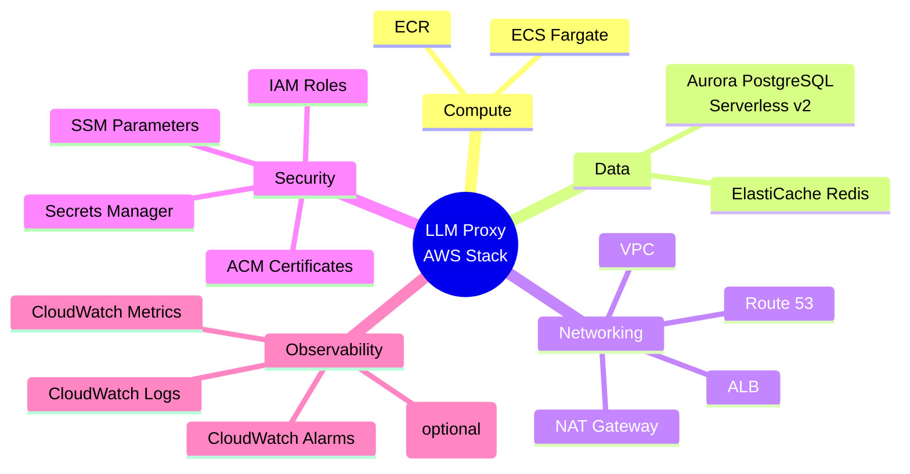
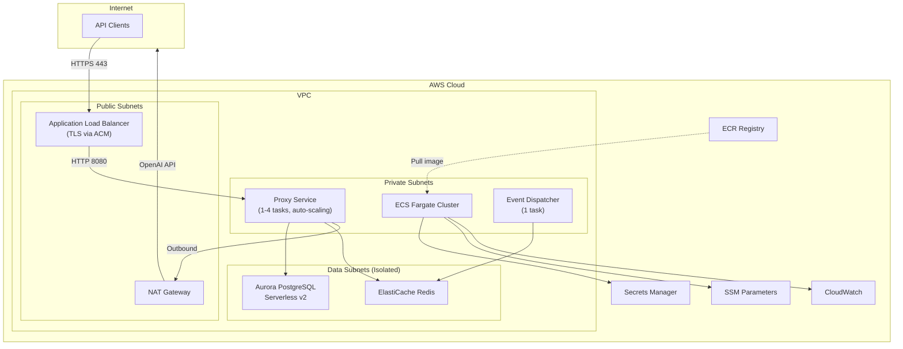
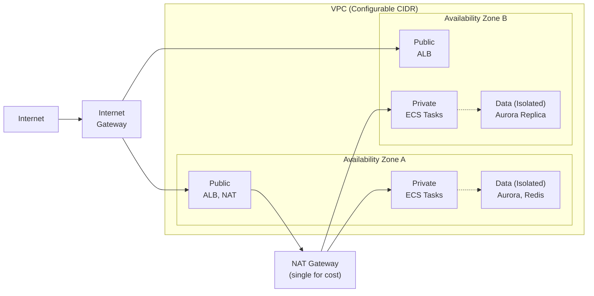
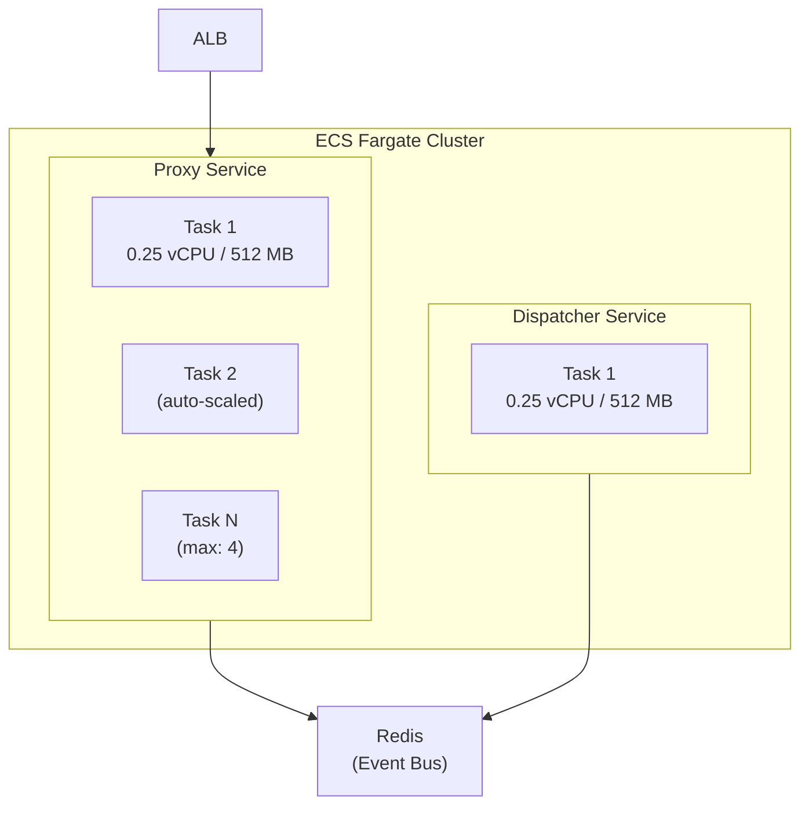
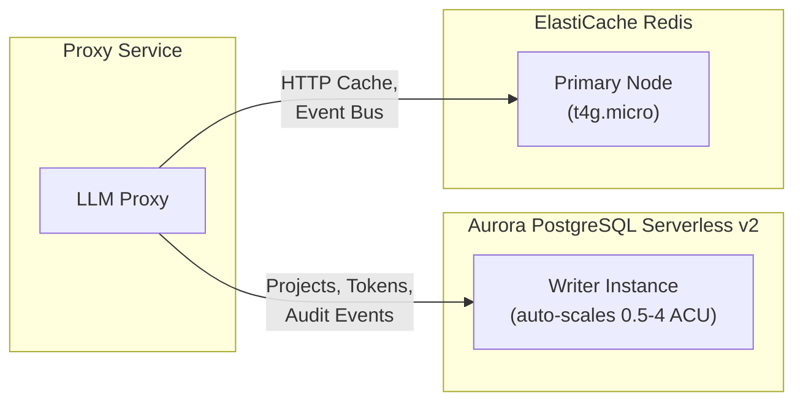
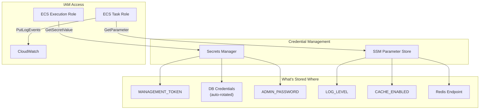
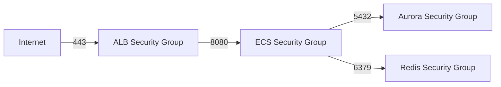
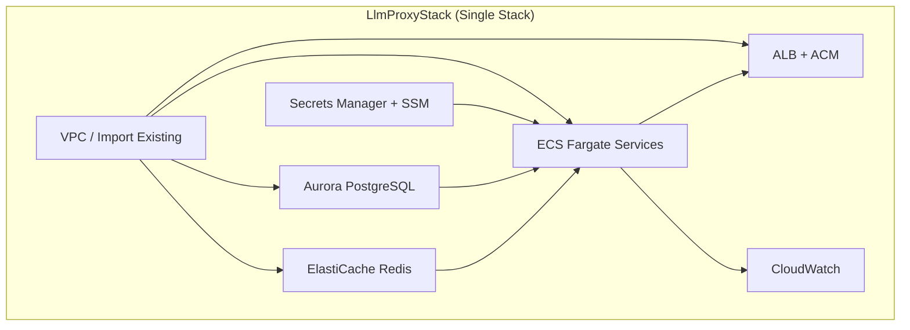
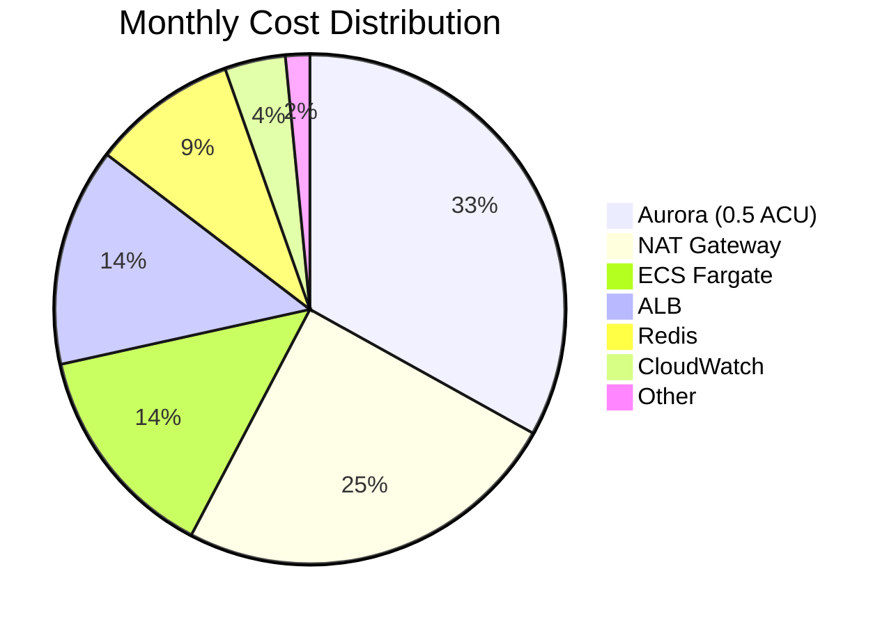
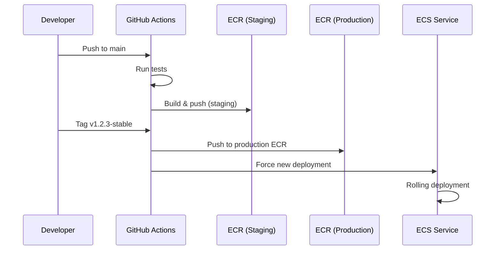

# AWS ECS Deployment Architecture (CDK)

**Status**: Planned  
**Related Issue**: [Issue #46](https://github.com/sofatutor/llm-proxy/issues/46)  
**Last Updated**: December 2, 2025

---

## Overview

This document defines the AWS infrastructure architecture for deploying the LLM Proxy using **AWS CDK (TypeScript)**. The design prioritizes **low cost for low traffic** while maintaining the ability to scale as demand grows.

### Design Principles

1. **Cost-First**: Start small (~$130/mo), scale when needed
2. **Fully Configurable**: All resources via CDK props (VPC, domain, sizing)
3. **Existing Infrastructure**: Support importing existing VPC, certificates, hosted zones
4. **Scalability Ready**: Auto-scaling enabled from day one

---

## AWS Services



| Category | Service | Purpose | Cost Impact |
|----------|---------|---------|-------------|
| **Compute** | ECS Fargate | Serverless containers | ~$18/mo (2 tasks) |
| **Database** | Aurora PostgreSQL Serverless v2 | Auto-scaling database | ~$43/mo (0.5 ACU min) |
| **Cache** | ElastiCache Redis | HTTP cache + event bus | ~$12/mo (t4g.micro) |
| **Load Balancer** | ALB | TLS termination, routing | ~$18/mo |
| **Networking** | NAT Gateway | Outbound internet | ~$32/mo (single) |
| **Secrets** | Secrets Manager | Credentials storage | ~$2/mo |
| **Config** | SSM Parameter Store | Non-sensitive config | Free |
| **TLS** | ACM | Certificates | **Free** |
| **DNS** | Route 53 | Domain management | ~$1/mo |

---

## High-Level Architecture



---

## Network Architecture

The VPC uses a 3-tier subnet architecture across 2 availability zones:



**Key Decision**: Single NAT Gateway  
- Saves ~$32/month vs dual NAT
- Trade-off: Cross-AZ traffic if NAT's AZ fails
- Can upgrade to 2 NAT gateways via config when needed

**VPC Import**: Can pass `existingVpcId` to use an existing VPC instead of creating a new one.

---

## Compute Architecture



### Auto-Scaling Policy

| Metric | Target | Scale Out | Scale In |
|--------|--------|-----------|----------|
| CPU | 70% | 2 min cooldown | 10 min cooldown |
| Requests/Target | 500 | 2 min cooldown | 10 min cooldown |

**Key Decision**: ARM64 (Graviton2)
- ~20% cost savings over x86
- Same Docker image (multi-arch build)

---

## Data Architecture



### Aurora Serverless v2 Scaling

| ACU | RAM | Use Case | Cost/Hour |
|-----|-----|----------|-----------|
| 0.5 | 1 GB | Idle/Low traffic | $0.06 |
| 1 | 2 GB | Light load | $0.12 |
| 2 | 4 GB | Moderate load | $0.24 |
| 4 | 8 GB | High load | $0.48 |

**Key Decision**: No read replica by default
- Serverless v2 handles read scaling
- Can add reader instance via config if needed

### Redis Configuration

**Key Decision**: Single node (no replica)
- Saves ~$12/month
- Trade-off: No automatic failover
- Event bus can recover (events re-fetched on reconnect)
- HTTP cache is non-critical (cache miss = upstream request)

---

## Security Architecture



### Network Security Groups



| Security Group | Inbound | Outbound |
|---------------|---------|----------|
| ALB | 443 from 0.0.0.0/0 | 8080 to ECS |
| ECS | 8080 from ALB | 5432, 6379 to Data; 443 to Internet |
| Aurora | 5432 from ECS | None |
| Redis | 6379 from ECS | None |

### TLS/ACM

**ACM certificates are FREE** and auto-renewed:
- Create new certificate with DNS validation
- Or import existing certificate ARN
- Or run HTTP-only for internal/dev environments

---

## CDK Stack Structure

### Single Stack Architecture (Recommended)

For simplicity, all resources are deployed in a **single stack**. This makes deployment straightforward (`cdk deploy`) and avoids cross-stack reference complexity.



**Benefits of Single Stack:**
- ✅ One command deployment: `cdk deploy`
- ✅ No cross-stack references to manage
- ✅ Simpler rollback and updates
- ✅ Easier to understand and maintain

### Directory Layout

```
infra/
├── bin/
│   └── app.ts              # CDK app entry point
├── lib/
│   ├── llm-proxy-stack.ts  # Single stack with all resources
│   ├── constructs/
│   │   ├── database.ts     # Aurora construct
│   │   ├── cache.ts        # Redis construct
│   │   └── service.ts      # ECS service construct
│   └── config/
│       └── types.ts        # Configuration props interface
├── scripts/
│   └── config.ts           # CLI for secrets & config management
├── cdk.json
└── package.json
```

---

## Secrets & Configuration Management

### Separation of Concerns

| Store | Purpose | Examples |
|-------|---------|----------|
| **Secrets Manager** | Sensitive, rotatable values | `management-token`, `openai-api-key` |
| **SSM Parameter Store** | Non-sensitive config | `log-level`, `rate-limit-rpm`, feature flags |

### CLI Wrapper

A thin CLI wrapper (`scripts/config.ts`) provides a unified interface for managing both secrets and configuration:

```bash
# Interactive setup wizard
npm run setup

# Secrets (Secrets Manager)
npm run secret:set <name> <value>
npm run secret:get <name>

# Config (SSM Parameter Store)
npm run config:set <name> <value>
npm run config:get <name>
npm run config:list
```

**Benefits:**
- Secrets never in version control or CDK code
- Unified interface for ops team
- Works with OIDC credentials
- SSM Parameter Store is free (vs Secrets Manager at $0.40/secret/month)

---

## Configuration Props

All infrastructure is configurable via a single props interface. Key configuration options:

| Category | Props | Default | Notes |
|----------|-------|---------|-------|
| **VPC** | `existingVpcId` | — | Import existing VPC |
| | `natGateways` | 1 | Set to 2 for HA |
| **Domain** | `domainName` | — | e.g., 'api.example.com' |
| | `existingCertificateArn` | — | Import existing ACM cert |
| **Aurora** | `auroraMinCapacity` | 0.5 | Minimum ACUs |
| | `auroraMaxCapacity` | 4 | Maximum ACUs |
| **Redis** | `redisNodeType` | t4g.micro | Instance size |
| | `redisNumNodes` | 1 | Set to 2 for replica |
| **ECS** | `proxyMinTasks` | 1 | Minimum tasks |
| | `proxyMaxTasks` | 4 | Maximum tasks |
| | `useArm64` | true | ARM64 for cost savings |
| **Observability** | `enableXRay` | false | Enable when needed |
| | `logRetentionDays` | 14 | CloudWatch retention |

---

## Cost Breakdown

### Low-Traffic Configuration (~$130/month)



| Component | Configuration | Monthly Cost |
|-----------|--------------|--------------|
| Aurora Serverless v2 | 0.5 ACU min | ~$43 |
| NAT Gateway | Single | ~$32 |
| ECS Fargate | 2 tasks × ARM64 | ~$18 |
| ALB | Base + requests | ~$18 |
| ElastiCache Redis | t4g.micro × 1 | ~$12 |
| CloudWatch | Logs (14 days) | ~$5 |
| Secrets Manager | 5 secrets | ~$2 |
| ACM + Route 53 | Certificate + DNS | ~$1 |
| **Total** | | **~$130** |

### Scaling Tiers

| Tier | Description | Est. Monthly |
|------|-------------|--------------|
| **Dev** | Single task, minimal resources | ~$130 |
| **Low Traffic** | 1-2 tasks, auto-scaling | ~$150 |
| **Medium** | 2+ tasks, 2 NATs, Redis replica | ~$300 |
| **Production** | Full HA, monitoring enabled | ~$600+ |

---

## Deployment Strategy

### Separation of Concerns

| Deployment Type | Method | Trigger |
|-----------------|--------|---------|
| **Application** | GitHub Actions → ECR → ECS | On merge to `main` |
| **Infrastructure** | `cdk deploy` (manual) | When architecture changes |

### Application Deployment (Automated)



### Deployment Environments

| Trigger | Target | ECR Tag | ECS Deploy |
|---------|--------|---------|------------|
| Push to `main` | Staging (optional) | `sha-abc123`, `latest` | Configurable |
| Tag `*-stable` | Production | `v1.2.3`, `stable` | Yes |

**Production deployment requires explicit `-stable` tag** (e.g., `v1.2.3-stable`).

### Configuration

Environment-specific settings via GitHub repository variables:

| Variable | Description | Example |
|----------|-------------|---------|
| `DEPLOY_STAGING` | Enable staging deployment on main push | `true` / `false` |
| `AWS_REGION` | AWS region | `eu-central-1` |
| `ECR_REPO_STAGING` | Staging ECR repository | `123.dkr.ecr...` |
| `ECR_REPO_PRODUCTION` | Production ECR repository | `123.dkr.ecr...` |
| `ECS_CLUSTER` | ECS cluster name | `llm-proxy` |

### Infrastructure Deployment (Manual)

Infrastructure changes via CDK are done manually:

```bash
cd infra

# Preview changes
cdk diff

# Deploy (when ready)
cdk deploy
```

**When to run `cdk deploy`:**
- Adding/removing AWS resources
- Changing instance sizes, scaling policies
- Updating security groups, IAM policies
- Modifying VPC, subnets, routing

**Why manual?**
- Infrastructure changes are infrequent
- Require review before applying
- Avoid accidental changes to production
- CDK can be destructive (e.g., database replacement)

---

## Integration with LLM Proxy

### Environment Variables Mapping

| LLM Proxy Config | AWS Source |
|-----------------|------------|
| `MANAGEMENT_TOKEN` | Secrets Manager |
| `DATABASE_URL` | Secrets Manager (Aurora) |
| `REDIS_CACHE_URL` | SSM Parameter (ElastiCache endpoint) |
| `REDIS_EVENT_URL` | SSM Parameter (ElastiCache endpoint) |
| `LOG_LEVEL` | SSM Parameter |

### Required Code Changes

1. **PostgreSQL Driver**: ✅ Already completed in Phase 5 (build with `-tags postgres`)
2. **Redis TLS**: Support `rediss://` URL scheme for ElastiCache
3. **Health Check**: Include DB/Redis connectivity in `/health`
4. **Graceful Shutdown**: Handle SIGTERM from ECS

---

## Next Steps

1. **Initialize CDK Project**: Create `infra/` directory with TypeScript setup
2. **Implement Stacks**: VPC → Secrets → Data → ECS → ALB → Observability
3. **CI/CD Pipeline**: GitHub Actions workflow for CDK deployment
4. **Testing**: Load testing and failover testing

> **Note**: PostgreSQL support is already complete (Phase 5). Build with `-tags postgres` to enable.

---

## Related Documents

- [Phase 6 AWS ECS Issue](../../issues/planned/phase-6-aws-ecs.md)
- [Phase 5 PostgreSQL Support](../../issues/done/phase-5-postgres-support.md) ✅
- [Main Architecture](../../architecture.md)
- [Brownfield Architecture](../../brownfield-architecture.md)

