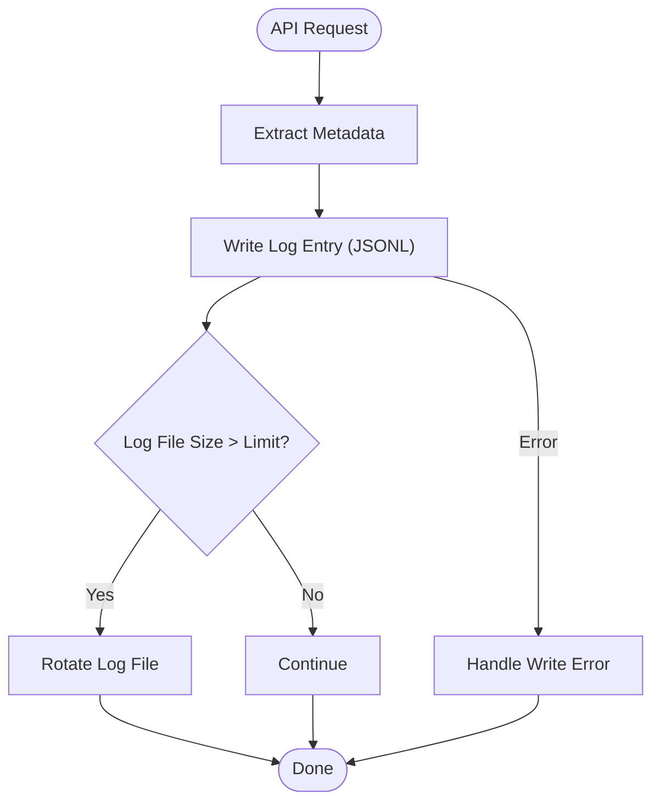

# Logging System Core

## Summary
Implement a comprehensive local logging system for the LLM proxy, using JSON Lines format, log rotation, and error handling.

## Rationale
- Local logging is required for compliance, debugging, and as a fallback for all observability features.
- JSON Lines format enables easy parsing and integration with external tools.
- Log rotation and configuration are necessary for production readiness.

## Tasks
- [x] Research logging best practices for Go applications
- [x] Define a comprehensive log format (fields: timestamp, level, message, endpoint, method, status, duration, token counts, errors, etc.)
- [x] Implement JSON Lines local logging
- [x] Set up log file creation and rotation
- [x] Add configuration options for log file location, rotation policy, and log levels
- [x] Add basic documentation for the logging system
- [x] Add unit tests for logging functionality

## Acceptance Criteria
- Local logging is implemented in JSON Lines format
- Log files are created and rotated according to configuration
- Log format includes all required fields
- Logging system is covered by unit tests
- Documentation is updated to describe logging configuration and usage 