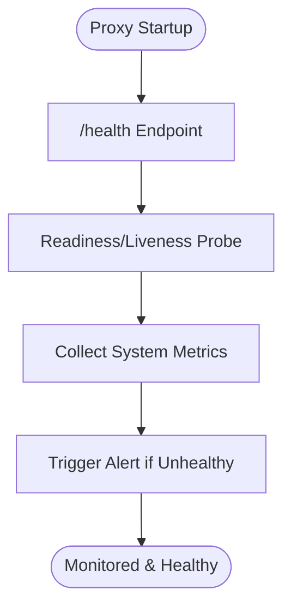

# Monitoring Core

## Summary
Implement health check endpoints, readiness/liveness probes, and basic system metrics for the LLM proxy.

## Rationale
- Health checks and probes are required for orchestration, deployment, and uptime monitoring.
- Basic system metrics provide insight into the health and performance of the proxy.

## Tasks
- [x] Implement a /health endpoint for health checks
- [x] Add readiness and liveness probes for deployment environments (e.g., Kubernetes)
- [x] Implement basic system metrics (e.g., uptime, request counts, error rates)
- [x] Document health check and monitoring endpoints
- [x] Add tests for health checks and probes

## Acceptance Criteria
- /health endpoint is available and returns status, timestamp, and version
- Readiness and liveness probes are implemented and documented
- Basic system metrics are available and tested
- Documentation and tests are updated accordingly

Implemented in code:
- `/health` returns JSON status, timestamp and version.
- `/ready` and `/live` endpoints return 200 for orchestration probes.
- `/metrics` exposes uptime, request count and error count in JSON.
