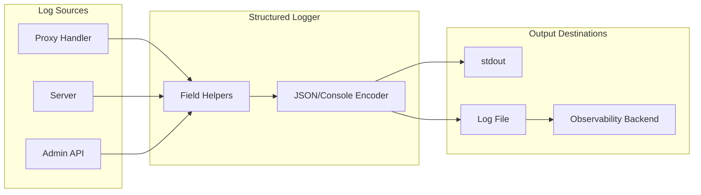
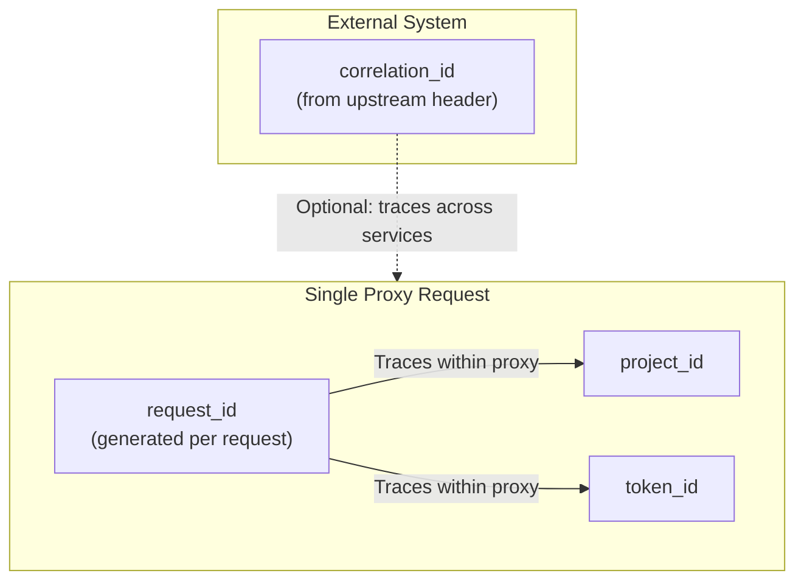
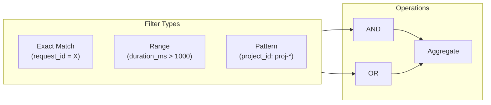

# Log Search and Filter Guide

This guide documents the canonical log fields used by LLM Proxy and provides guidance for searching and filtering logs in various observability backends.

## Log Flow Architecture

## Canonical Log Fields

The proxy uses structured JSON logging via `internal/logging/logger.go`. All fields are documented in the source code with canonical helper functions.

| Field | Type | Description |
|-------|------|-------------|
| `ts` | string | ISO8601 timestamp |
| `level` | string | Log level (debug, info, warn, error) |
| `msg` | string | Log message |
| `caller` | string | Source file:line |
| `request_id` | string | Unique request identifier (UUIDv7) |
| `correlation_id` | string | Cross-service trace ID |
| `project_id` | string | Project identifier |
| `token_id` | string | Obfuscated token |
| `client_ip` | string | Client IP address |
| `method` | string | HTTP method |
| `path` | string | Request URL path |
| `status_code` | int64 | HTTP response status code |
| `duration_ms` | int64 | Request duration in milliseconds |
| `component` | string | Logger component name |
| `error` | string | Error message (when applicable) |

> **Source of Truth**: See `internal/logging/logger.go` for the authoritative field definitions and helper functions.

## Field Relationships

**Key Distinctions:**
- `request_id`: Generated for each incoming request—use to trace a single request through the proxy
- `correlation_id`: Passed from upstream services—use to trace across multiple services in a distributed system

## Field Availability by Component

| Field | Proxy | Server | Admin |
|-------|:-----:|:------:|:-----:|
| Base fields (`ts`, `level`, `msg`, `caller`) | ✓ | ✓ | ✓ |
| `request_id` | ✓ | ✓ | ✓ |
| `correlation_id` | ✓* | ✓* | ✓* |
| `project_id`, `token_id` | ✓ | - | ✓ |
| `client_ip`, `method`, `path` | ✓ | ✓ | ✓ |
| `status_code`, `duration_ms` | ✓ | ✓ | ✓ |

\* `correlation_id` is available in any component when present in the request context. It is typically set by the proxy for incoming requests and propagated to other components if the context includes it.

## Token ID Obfuscation

Tokens are automatically obfuscated in logs for security. The obfuscation logic is implemented in `internal/obfuscate/obfuscate.go`.

| Token Length | Rule |
|--------------|------|
| ≤ 4 chars | All asterisks |
| 5-12 chars | Keep first 2, asterisks for rest |
| > 12 chars | Keep first 8 + `...` + last 4 |

> **Important**: Never log raw tokens. Always use `logging.TokenID()` which automatically applies obfuscation.

---

## Query Patterns

The following patterns apply across all backends. Adapt the syntax to your specific observability platform.

### Common Filter Categories

| Category | Fields | Purpose |
|----------|--------|---------|
| **Identity** | `request_id`, `correlation_id` | Trace specific requests |
| **Scope** | `project_id`, `token_id` | Filter by tenant/auth |
| **Performance** | `duration_ms`, `status_code` | Find slow/failing requests |
| **Location** | `path`, `method`, `client_ip` | Filter by endpoint/source |
| **Severity** | `level`, `error` | Find problems |

### Query Building Blocks

### Backend Query Syntax Reference

| Operation | jq | Loki | Elasticsearch | Datadog |
|-----------|-----|------|---------------|---------|
| Exact match | `select(.field == "value")` | `field=\`value\`` | `field: "value"` | `@field:value` |
| Numeric comparison | `select(.field > N)` | `field > N` | `field >= N` | `@field:>N` |
| Error filter | `select(.level == "error")` | `level=\`error\`` | `level: "error"` | `@level:error` |
| Combine (AND) | `select(A and B)` | `A \| B` | `A AND B` | `A B` |

> **Note**: Refer to your backend's official documentation for complete query syntax and capabilities.

---

## CLI Helper Script

A helper script is available at `scripts/log-search.sh` for common local log searches using `jq`.

**Run `./scripts/log-search.sh --help` for usage details.**

Key capabilities:
- Filter by `request_id`, `correlation_id`, `project_id`
- Find errors (`--errors`)
- Find slow requests (`--slow <ms>`)
- Filter by path or status code
- Combine multiple filters
- Read from file or stdin

---

## Related Documentation

- [Instrumentation Guide](instrumentation.md) - Event system, async middleware, and monitoring
- [Architecture Overview](architecture.md) - System architecture and components
- [Security Best Practices](../deployment/security.md) - Token obfuscation and audit logging
- Source: `internal/logging/logger.go` - Canonical field definitions
