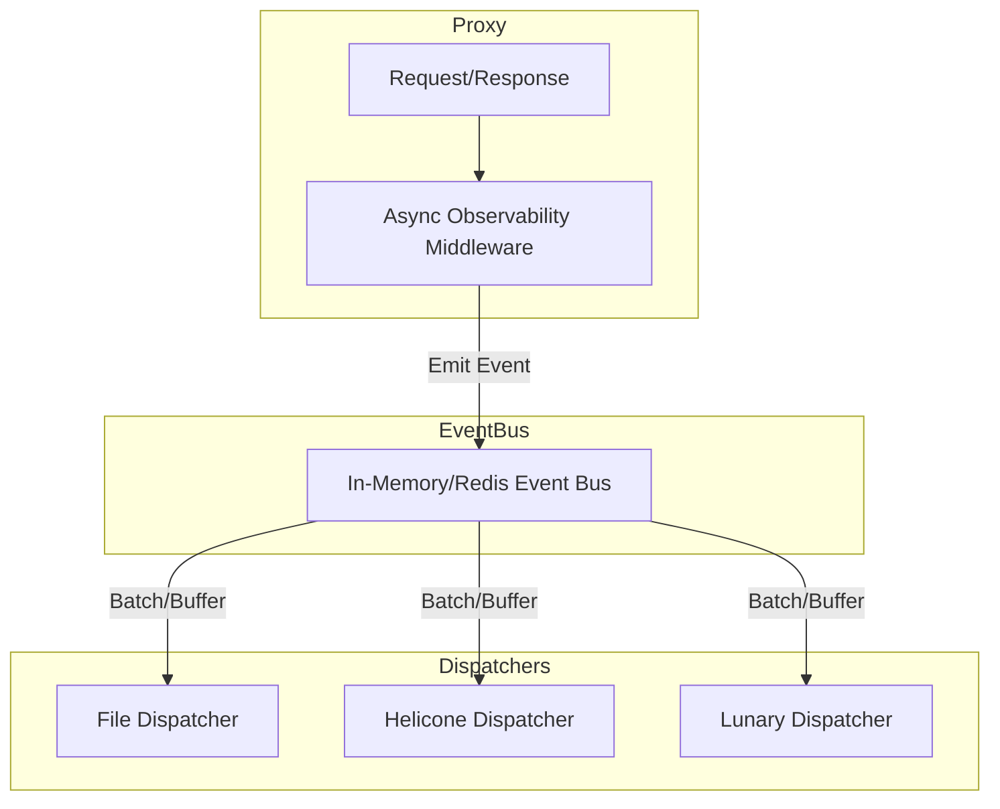

# Instrumentation Middleware: Usage & Extension Guide

## Overview
The async instrumentation middleware provides non-blocking, streaming-capable instrumentation for all API calls handled by the LLM Proxy. It captures request/response metadata and emits events to a pluggable event bus for downstream processing (e.g., file, cloud, analytics).

## Enabling Instrumentation
To enable the middleware, set the following environment variable:

```sh
OBSERVABILITY_ENABLED=true
```

You can also control the event buffer size:

```sh
OBSERVABILITY_BUFFER_SIZE=200  # Default: 100
```

## Configuration Reference
- `OBSERVABILITY_ENABLED` (bool): Enable/disable the instrumentation middleware (default: false)
- `OBSERVABILITY_BUFFER_SIZE` (int): Buffer size for event bus (default: 100)
- `OBSERVABILITY_BACKEND` (string): Event bus backend type ("memory" or "redis", default: "memory") 
- `OBSERVABILITY_REDIS_URL` (string): Redis URL for event bus when backend=redis (default: "redis://localhost:6379/0")

## Event Bus Backends
- **In-Memory** (default): Fast, simple, for local/dev use. Events are lost on restart.
- **Redis**: Persistent, distributed event storage using Redis Streams. Supports multiple dispatchers and survives restarts.

## Event Dispatcher Service

The event dispatcher is a separate CLI service that consumes events from the event bus and delivers them to various backends. Run it alongside the main server:

```sh
# File dispatcher (logs events to a file)
llm-proxy dispatcher --service file --filepath /var/log/llm-events.jsonl

# Helicone dispatcher (sends to Helicone observability platform)
llm-proxy dispatcher --service helicone --api-key $HELICONE_API_KEY

# Lunary dispatcher (sends to Lunary observability platform)  
llm-proxy dispatcher --service lunary --api-key $LUNARY_API_KEY

# Use Redis event bus for distributed setup
llm-proxy dispatcher --service file --filepath /tmp/events.jsonl --event-bus redis --redis-url redis://localhost:6379/0

# Configure batching and workers for high throughput
llm-proxy dispatcher --service helicone --api-key $HELICONE_API_KEY --batch-size 50 --workers 3
```

### Available Dispatcher Services
- **file**: Writes events to a JSON Lines file
- **helicone**: Sends events to Helicone observability platform  
- **lunary**: Sends events to Lunary observability platform

### Dispatcher Configuration
- `--service`: Backend service (file, helicone, lunary)
- `--event-bus`: Event bus type (memory, redis) 
- `--redis-url`: Redis connection URL
- `--batch-size`: Number of events per batch (default: 10)
- `--workers`: Number of parallel workers (default: 1)
- `--api-key`: API key for external services
- `--endpoint`: Custom endpoint URL for external services

## How It Works
- When enabled, the middleware wraps all proxy requests and responses.
- Captures request ID, method, path, status, duration, headers, and full (streamed) response body.
- Emits an event to the configured event bus (in-memory by default).
- Event delivery is fully async and non-blocking.

## Event Bus Backends
- **In-Memory** (default): Fast, simple, for local/dev use. Events are lost on restart.
- **Redis**: Persistent, distributed event storage using Redis Streams. Supports multiple dispatchers and survives restarts.
- **Custom/Redis**: Implement the `EventBus` interface and inject via config for distributed or persistent event delivery.

## Event Schema Example
```go
// eventbus.Event
Event {
  RequestID       string
  Method          string
  Path            string
  Status          int
  Duration        time.Duration
  ResponseHeaders http.Header
  ResponseBody    []byte
}
```

## Example: Enabling in Docker
```sh
docker run -d \
  -e OBSERVABILITY_ENABLED=true \
  -e OBSERVABILITY_BUFFER_SIZE=200 \
  -e OBSERVABILITY_BACKEND=redis \
  -e OBSERVABILITY_REDIS_URL=redis://redis:6379/0 \
  ...
```

## Architecture: Event Bus & Dispatcher



The proxy emits events asynchronously to the event bus. One or more dispatcher services consume events and deliver them to their respective backends. This ensures zero blocking I/O in the request path.

## Extending the Middleware
- **Custom Event Schema**: Extend `eventbus.Event` or create your own struct. Update the middleware to emit your custom event type.
- **New Event Bus Backends**: Implement the `EventBus` interface (see `internal/eventbus/eventbus.go`). Plug in your backend (e.g., Redis, Kafka, HTTP, etc.).
- **New Consumers/Dispatchers**: Write a dispatcher that subscribes to the event bus and delivers events to your backend (file, cloud, analytics, etc.).

## Example: Custom EventBus Backend
```go
type MyEventBus struct { /* ... */ }
func (b *MyEventBus) Publish(ctx context.Context, evt eventbus.Event) { /* ... */ }
func (b *MyEventBus) Subscribe() <-chan eventbus.Event { /* ... */ }
```

## References
- See `internal/middleware/instrumentation.go` for the middleware implementation.
- See `internal/eventbus/eventbus.go` for the event bus interface and in-memory backend.
- See `docs/issues/phase-5-generic-async-middleware.md` for the original design issue.

---
For questions or advanced integration, open an issue or see the code comments for extension points. 