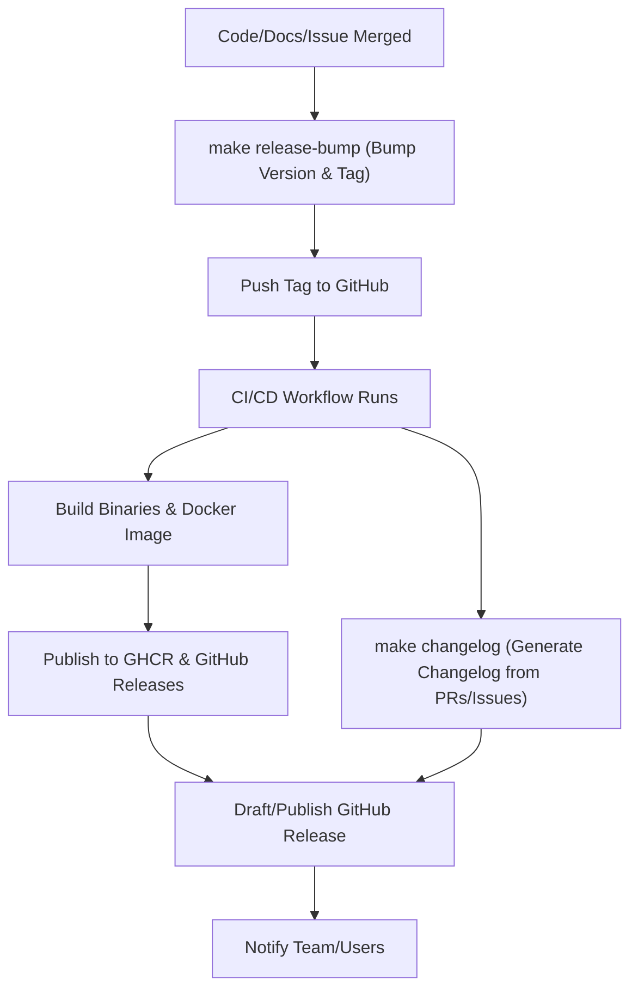
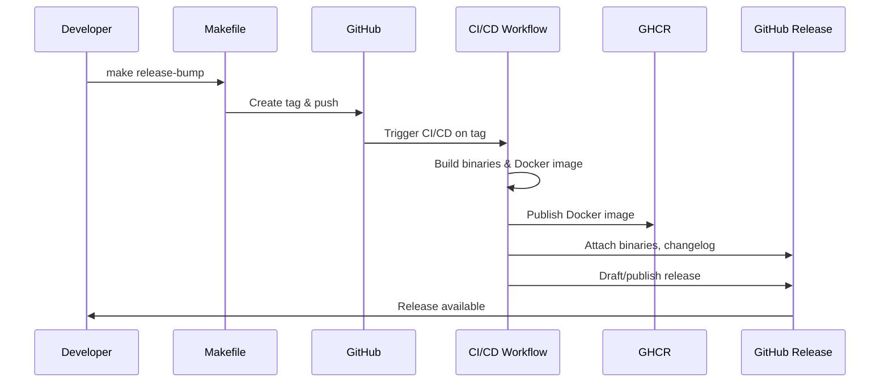
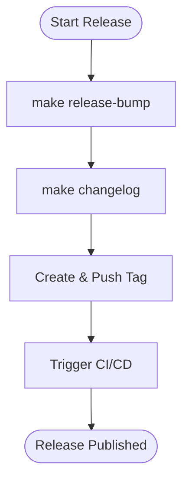

# Release Workflow: GitHub Releases, Docker, Versioning, and Automation

## Summary
Set up a robust release workflow for the LLM proxy project, including GitHub Releases, Docker image publishing to GitHub Container Registry (GHCR), semantic versioning/tagging, automated CI/CD, and Makefile targets to streamline release drafting and operational chores.

## Rationale
- Automated, transparent releases ensure reliability, traceability, and ease of deployment for users.
- Semantic versioning and tagging provide clarity and consistency for all stakeholders.
- Publishing Docker images to GHCR enables easy, secure deployment in any environment.
- Makefile targets reduce manual errors and streamline operational tasks.

## Tasks
- [ ] Configure GitHub Actions workflow for building and publishing Docker images to GHCR on every tagged release
- [ ] Set up GitHub Releases to attach binaries, Docker images, and changelogs
- [ ] Enforce semantic versioning for all release tags (e.g., v1.2.3)
- [ ] Automate changelog generation from merged PRs and issues (Makefile target)
- [ ] Add Makefile targets for:
    - Version bumping and tagging (`make release-bump`)
    - Changelog generation (`make changelog`)
    - Pushing tags and triggering CI/CD
    - Drafting/publishing GitHub Releases
- [ ] Document the release process in `/docs/release.md`
- [ ] Add tests for Makefile release targets and CI/CD workflows

## Acceptance Criteria
- Releases are published via GitHub Releases with semantic version tags
- Docker images are built and published to GHCR for each release
- Changelogs are generated automatically from PRs/issues (Makefile target)
- Makefile targets for release chores are available and documented
- The release process is fully automated, tested, and documented

