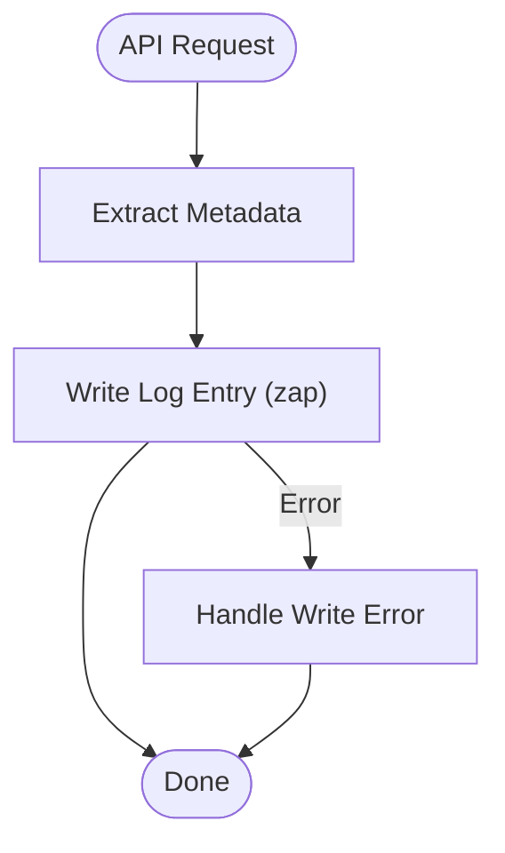

# Logging System Core

## Summary
Implement a simple, structured local logging system for the LLM proxy, using zap for application-level logs. No log rotation is required due to the expected low volume of app logs.

## Rationale
- Application-level logs (startup, errors, admin actions) are expected to be low-volume.
- Simplicity and maintainability are prioritized; log rotation is not needed.
- Structured logging (timestamp, level, message, context) enables easy debugging and searchability.
- Log level should be configurable for different environments.

## Tasks
- [x] Research logging best practices for Go applications
- [x] Define a comprehensive log format (fields: timestamp, level, message, endpoint, method, status, duration, token counts, errors, etc.)
- [x] Implement zap-based local logging
- [x] Add configuration options for log file location and log levels
- [x] Add basic documentation for the logging system
- [x] Add unit tests for logging functionality

## Acceptance Criteria
- Application-level logging is implemented using zap
- Log format includes all required fields
- Log level and output location are configurable
- Logging system is covered by unit tests
- Documentation is updated to describe logging configuration and usage 