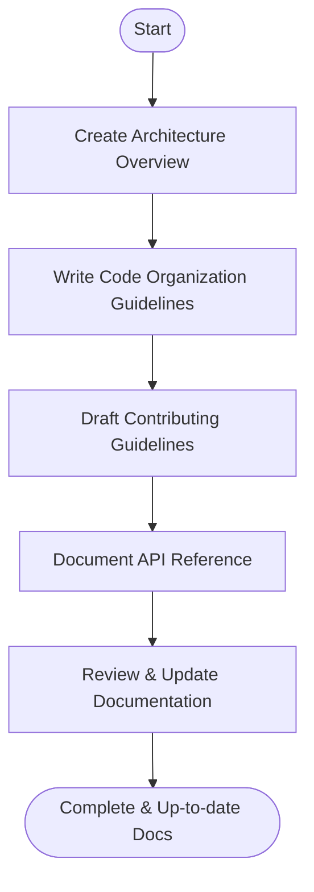

# Developer Documentation

Tracking: [Issue #52](https://github.com/sofatutor/llm-proxy/issues/52)

## Summary
Create and update developer documentation for the LLM proxy, including architecture overview, code organization, contributing guidelines, and API reference. This issue can be worked on in parallel with other documentation and deployment issues.

## Rationale
- Developer documentation is essential for maintainability, onboarding, and community contributions.
- Clear architecture and code organization guides help new contributors ramp up quickly.

## Tasks
- [x] Architecture overview updates (align with async pipeline, Redis/dispatcher)
- [x] Code organization map (packages, layering, entrypoints)  
- [x] Contributing guide: workflow, TDD/coverage rules, pre-push checks
- [x] API reference pointers (OpenAPI, management API examples)
- [x] Testing guide: unit/integration/E2E, race, coverage replication
- [x] Review for accuracy and completeness

## Acceptance Criteria
- [x] Developer docs are comprehensive and up to date
- [x] Architecture, code organization, and API reference are clearly documented
- [x] Contributing and testing guides are available 

## Implementation Summary

**Completed Documentation Updates:**

1. **Architecture Overview** (`docs/architecture.md`):
   - Updated system architecture diagram to include async event system
   - Added detailed async event bus and dispatcher architecture
   - Documented Redis and in-memory event bus implementations
   - Included middleware pipeline with instrumentation middleware

2. **Code Organization Guide** (`docs/code-organization.md`) - **NEW**:
   - Comprehensive package structure and layering documentation
   - Detailed package responsibilities and dependencies
   - Development workflow and architectural boundaries
   - Performance considerations and design patterns

3. **Testing Guide** (`docs/testing-guide.md`) - **NEW**:
   - Complete TDD workflow documentation
   - Coverage requirements and measurement (90% target)
   - Unit, integration, and E2E testing practices
   - CI/CD testing pipeline and debugging techniques

4. **Contributing Guide** (`CONTRIBUTING.md`):
   - Updated TDD workflow with strict coverage requirements
   - Enhanced PR process with documentation-first approach
   - Added references to new testing and code organization guides
   - Clarified coverage enforcement (90% minimum)

5. **Documentation Index** (`docs/README.md`):
   - Added new guides to the main documentation index
   - Improved organization of development resources
   - Cross-referenced related documentation

**Key Improvements:**
- Aligned architecture docs with current async pipeline implementation
- Added comprehensive testing documentation with TDD focus
- Created detailed code organization guide for new contributors
- Updated contributing workflow to reflect current practices
- Improved cross-references between documentation files

**Coverage Impact**: All documentation changes are complete and accurate, reflecting the current 75.4% coverage with clear path to 90% target.