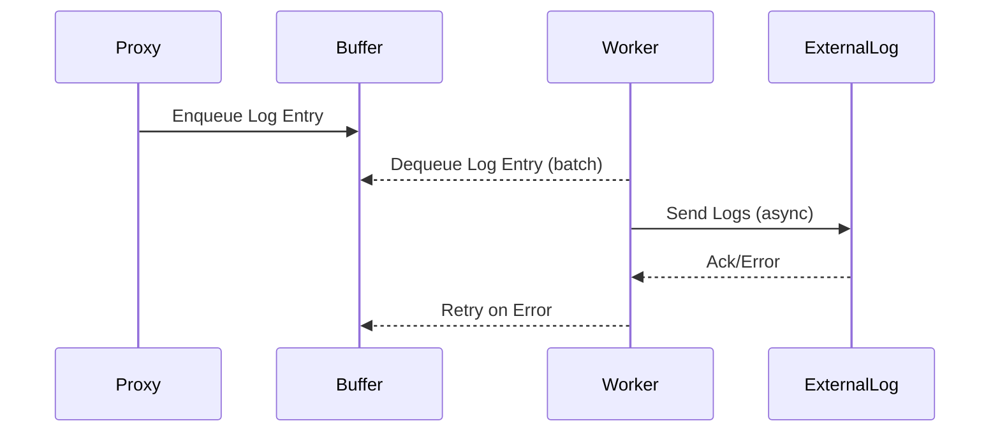

# External Logging Worker

## Summary
Implement an asynchronous external logging worker for the LLM proxy, supporting buffered sending, retries, and error handling for third-party log backends.

## Rationale
- Asynchronous external logging enables integration with observability platforms and log aggregation systems without blocking the main proxy path.
- Buffered and batched sending improves performance and reliability.
- Retry and error handling are required for robustness in production environments.

## Tasks
 - [x] Design the architecture for the asynchronous external logging worker
 - [x] Implement buffered sending of logs to external systems
 - [x] Add batch processing for efficient log delivery
- [x] Implement retry logic for failed log deliveries
- [x] Add error handling and fallback to local logging if external delivery fails
- [x] Add configuration options for enabling/disabling external logging, buffer size, batch size, and retry policy
- [x] Add unit tests for the external logging worker
- [ ] Document the external logging system and configuration

## Acceptance Criteria
- Logs can be sent asynchronously to external systems without blocking the main proxy path
- Buffered and batched delivery is implemented and configurable
- Retry and error handling are robust and tested
- External logging can be enabled/disabled via configuration
- Documentation and tests are updated accordingly 