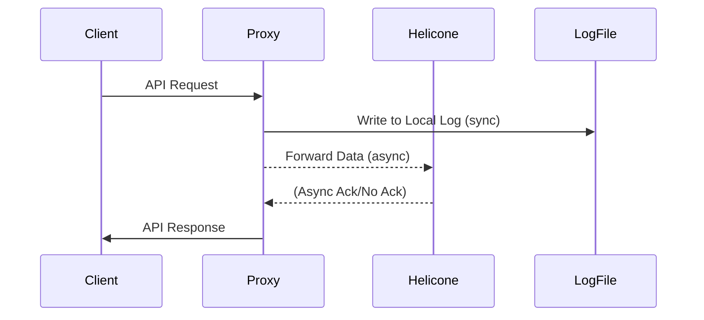

# Helicone Middleware Integration

## Summary
Integrate Helicone as an optional, asynchronous observability middleware for the LLM proxy. Ensure it does not replace custom logging and operates asynchronously to minimize latency.

## Rationale
- Helicone provides advanced LLM observability and analytics with minimal integration effort.
- All Helicone operations must be async to ensure minimum latency, in line with the project's minimum latency mandate.
- Helicone is additive and opt-in, not a critical dependency. No vendor lock-in: disabling Helicone reverts to local logging only.

## Tasks
- [ ] Research Helicone's Go/generic integration options (gateway, HTTP API, etc.)
- [ ] Implement Helicone as a Go HTTP middleware (or via generic gateway/async logging API)
- [ ] Ensure all Helicone calls are asynchronous and non-blocking
- [ ] Add configuration/env flags to enable/disable Helicone integration
- [ ] Update tests to cover both enabled/disabled modes (mocked, async)
- [ ] Document Helicone integration, configuration, and fallback behavior

## Acceptance Criteria
- Helicone integration is optional, async, and does not block or slow down the proxy path
- Custom logging remains canonical and always-on
- Documentation and tests are updated accordingly 