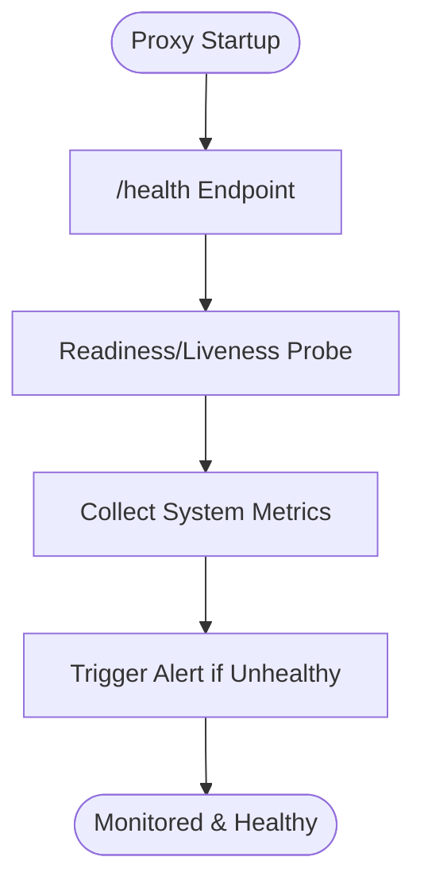

# Monitoring Core

## Summary
Implement health check endpoints, readiness/liveness probes, and basic system metrics for the LLM proxy.

## Rationale
- Health checks and probes are required for orchestration, deployment, and uptime monitoring.
- Basic system metrics provide insight into the health and performance of the proxy.

## Tasks
- [ ] Implement a /health endpoint for health checks
- [ ] Add readiness and liveness probes for deployment environments (e.g., Kubernetes)
- [ ] Implement basic system metrics (e.g., uptime, request counts, error rates)
- [ ] Document health check and monitoring endpoints
- [ ] Add tests for health checks and probes

## Acceptance Criteria
- /health endpoint is available and returns status, timestamp, and version
- Readiness and liveness probes are implemented and documented
- Basic system metrics are available and tested
- Documentation and tests are updated accordingly 