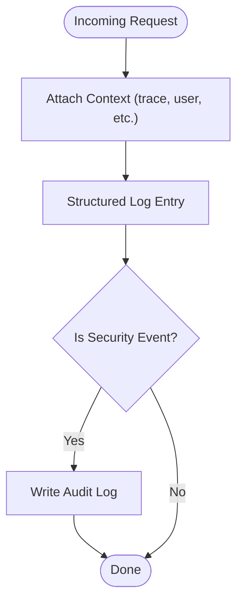

# Log Integration

Tracking: [Issue #43](https://github.com/sofatutor/llm-proxy/issues/43)

## Summary
Integrate structured logging, context propagation, and audit logging throughout the LLM proxy application.

## Rationale
- Structured logging enables better analysis, filtering, and correlation of logs across distributed systems.
- Log context propagation is essential for tracing requests and debugging.
- Audit logging is required for security and compliance.

## Tasks
- [ ] Add structured logging to all major components and request flows
- [x] Implement log context propagation (e.g., request IDs, correlation IDs)
- [ ] Create utilities for log search and filtering
- [ ] Set up log aggregation for distributed deployments (e.g., via external log systems)
- [ ] Implement audit logging for security events (e.g., token creation, deletion, access)
- [ ] Document log integration, context propagation, and audit logging
- [x] Add tests for structured logging (middleware and helpers)

## Acceptance Criteria
- All major components use structured logging
- Log context is propagated and available in logs
- Audit logging is implemented for security events
- Utilities for log search/filtering are available
- Documentation and tests are updated accordingly 

## Progress
- Implemented request/correlation ID propagation middleware with response headers and context helpers.
- Introduced structured logging helpers and updated server/proxy request lifecycle logging.
- Observability middleware now attaches request_id reliably for downstream events.
- Helicone manual-logger payloads improved to carry usage and provider hints (enables cost in Helicone).
- Added comprehensive tests for logging helpers and ID middleware.

Related PR: [PR #56](https://github.com/sofatutor/llm-proxy/pull/56)

## Remaining Work
- Audit logging for security events (token/project CRUD, access) with explicit audit log sink.
- Utilities for log search/filtering (guides, field conventions, or helper tooling).
- Log aggregation setup guidance for distributed deployments.
- Documentation covering the new logging/context propagation and audit logging usage.