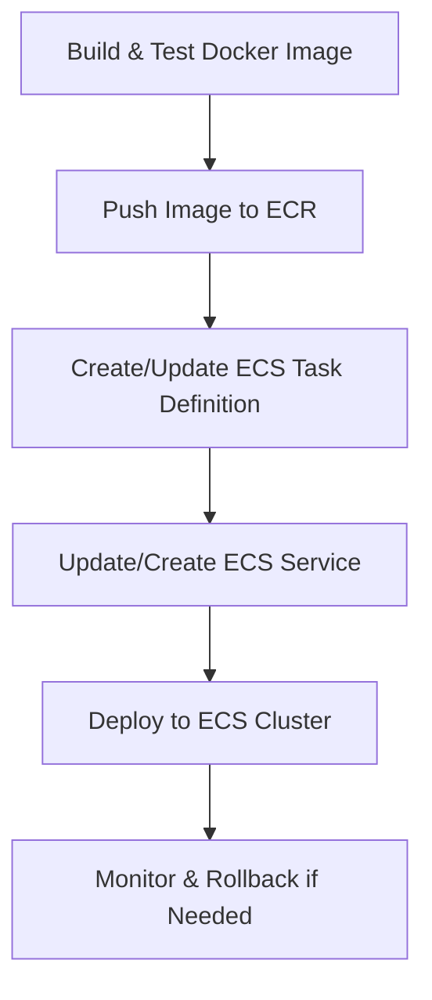

# AWS ECS Deployment

## Summary
Document and implement deployment of the LLM proxy to AWS ECS, including containerization, task definition, service setup, and CI/CD integration.

## Rationale
- AWS ECS enables scalable, reliable, and managed container deployments in the AWS ecosystem.
- Proper secrets management and deployment testing are critical for security and stability.

## Tasks
- [ ] Create ECS task definitions and service configuration for the LLM proxy
- [ ] Implement secrets management using AWS Secrets Manager or SSM Parameter Store
- [ ] Set up logging, health checks, and autoscaling in ECS
- [ ] Test ECS deployment for functionality, reliability, and scaling
- [ ] Document AWS ECS deployment process and best practices

## Acceptance Criteria
- ECS task and service configs are available and tested
- Secrets management is implemented and documented
- Logging, health checks, and autoscaling are configured
- Documentation and tests are updated accordingly 