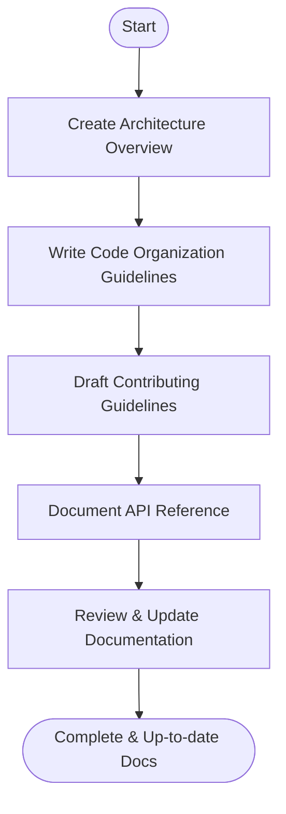

# Developer Documentation

Tracking: [Issue #52](https://github.com/sofatutor/llm-proxy/issues/52)

## Summary
Create and update developer documentation for the LLM proxy, including architecture overview, code organization, contributing guidelines, and API reference. This issue can be worked on in parallel with other documentation and deployment issues.

## Rationale
- Developer documentation is essential for maintainability, onboarding, and community contributions.
- Clear architecture and code organization guides help new contributors ramp up quickly.

## Tasks
- [ ] Create architecture overview documentation
- [ ] Write code organization guidelines
- [ ] Draft contributing guidelines
- [ ] Document API reference
- [ ] Review and update documentation for accuracy
- [ ] Draft testing guidelines

## Acceptance Criteria
- Developer docs are comprehensive and up to date
- Architecture, code organization, and API reference are clearly documented
- Contributing and testing guides are available 