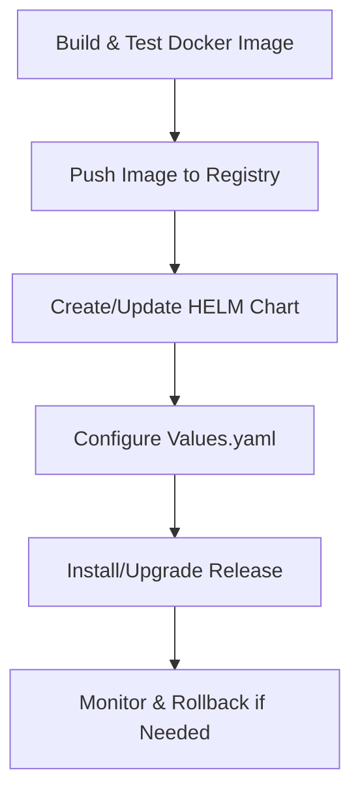

# Kubernetes Deployment with HELM

## Summary
Document and implement deployment of the LLM proxy to Kubernetes using HELM charts, including chart creation, configuration, and CI/CD integration.

## Rationale
- Kubernetes is the industry standard for scalable, portable, and reliable container orchestration.
- HELM charts simplify deployment, upgrades, and configuration management.
- Proper secrets management and deployment testing are critical for security and stability.

## Tasks
- [ ] Create Kubernetes manifests for the LLM proxy (Deployment, Service, Ingress, etc.)
- [ ] Develop a HELM chart for easy deployment and configuration
- [ ] Implement secrets management using Kubernetes Secrets or external providers
- [ ] Set up logging, health checks, and autoscaling in Kubernetes
- [ ] Test Kubernetes deployment for functionality, reliability, and scaling
- [ ] Document Kubernetes and HELM deployment process and best practices

## Acceptance Criteria
- Kubernetes manifests and HELM chart are available and tested
- Secrets management is implemented and documented
- Logging, health checks, and autoscaling are configured
- Documentation and tests are updated accordingly 