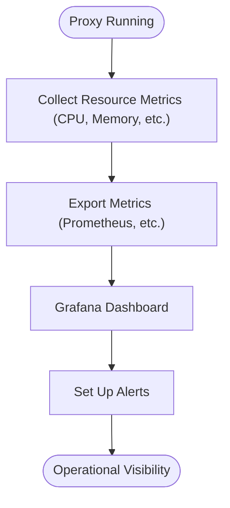

# Resource Usage Monitoring & Grafana Dashboards

Tracking: [Issue #54](https://github.com/sofatutor/llm-proxy/issues/54)

## Summary
Implement resource usage monitoring and provide Grafana dashboard templates for the LLM proxy.

## Rationale
- Resource usage monitoring is important for capacity planning and operational stability.
- Grafana dashboards provide a user-friendly way to visualize system metrics and trends.

## Tasks
- [ ] Implement resource usage monitoring (CPU, memory, disk, etc.)
- [ ] Create (optional) dashboard templates for Grafana
- [ ] Document resource usage monitoring and dashboard setup
- [ ] Add tests for resource usage monitoring endpoints

## Acceptance Criteria
- Resource usage monitoring is implemented and tested
- (Optional) Grafana dashboard templates are available and documented
- Documentation and tests are updated accordingly 