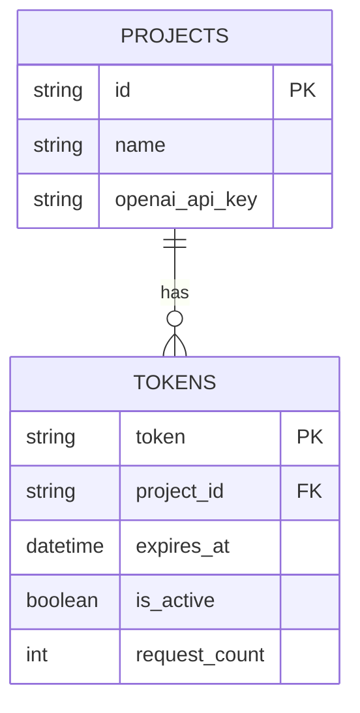

# Database Optimization

## Summary
Review and optimize database schema, queries, and indexes for performance and scalability. Ensure support for both SQLite and PostgreSQL.

## Rationale
- Database performance is critical for overall system throughput and latency.
- Query optimization and caching reduce load and improve response times.

## Tasks
- [ ] Profile and optimize all major database queries
- [ ] Improve index usage and add indexes where needed
- [ ] Implement or improve connection management and pooling
- [ ] Add query caching for frequent or expensive queries
- [ ] Add tests and benchmarks for database performance
- [ ] Document database optimization strategies

## Acceptance Criteria
- Database queries and indexes are optimized
- Connection management and caching are implemented and tested
- Documentation and tests are updated accordingly 