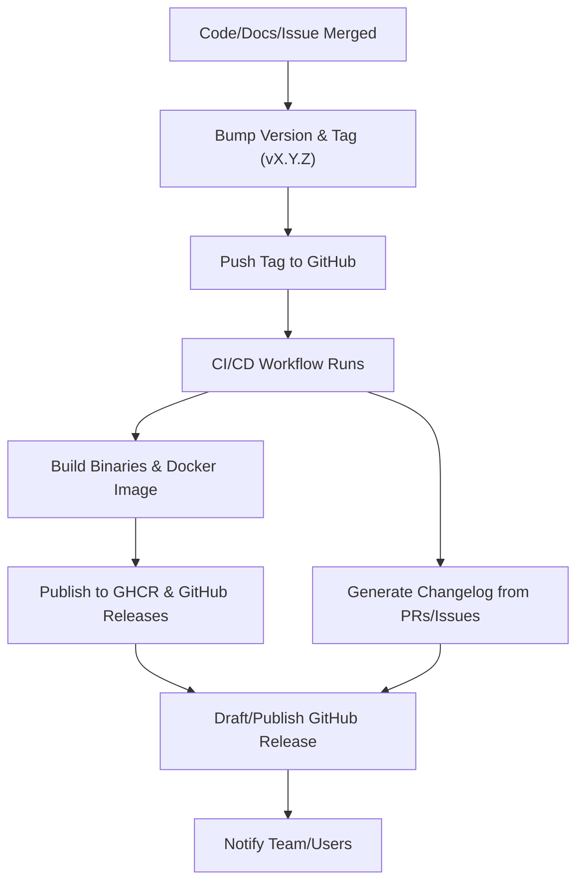
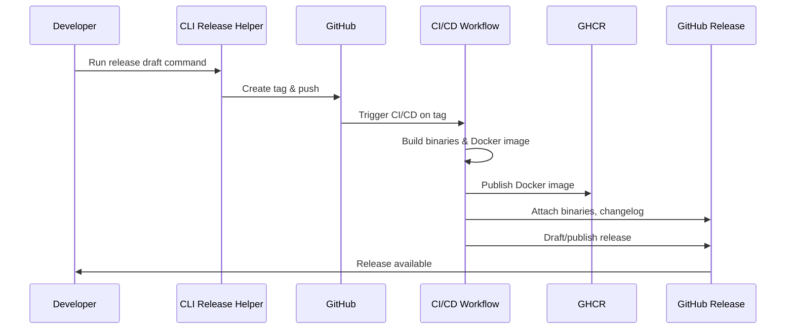
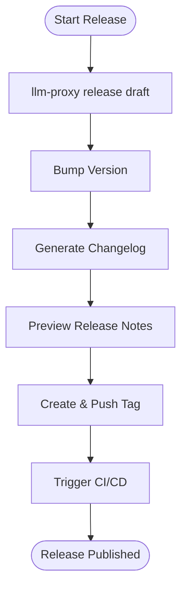

# Release Workflow: GitHub Releases, Docker, Versioning, and Automation

## Summary
Set up a robust release workflow for the LLM proxy project, including GitHub Releases, Docker image publishing to GitHub Container Registry (GHCR), semantic versioning/tagging, automated CI/CD, and a CLI command to streamline release drafting and operational chores.

## Rationale
- Automated, transparent releases ensure reliability, traceability, and ease of deployment for users.
- Semantic versioning and tagging provide clarity and consistency for all stakeholders.
- Publishing Docker images to GHCR enables easy, secure deployment in any environment.
- A CLI release helper reduces manual errors and streamlines operational tasks.

## Tasks
- [ ] Configure GitHub Actions workflow for building and publishing Docker images to GHCR on every tagged release
- [ ] Set up GitHub Releases to attach binaries, Docker images, and changelogs
- [ ] Enforce semantic versioning for all release tags (e.g., v1.2.3)
- [ ] Automate changelog generation from merged PRs and issues
- [ ] Implement a CLI command (e.g., `llm-proxy release draft`) to:
    - Bump version and create a new tag
    - Generate and preview changelog
    - Push tag and trigger CI/CD
    - Optionally draft a GitHub Release with artifacts
- [ ] Document the release process in `/docs/release.md`
- [ ] Add tests for the CLI release helper and CI/CD workflows

## Acceptance Criteria
- Releases are published via GitHub Releases with semantic version tags
- Docker images are built and published to GHCR for each release
- Changelogs are generated automatically from PRs/issues
- The CLI release command is available and documented
- The release process is fully automated, tested, and documented

