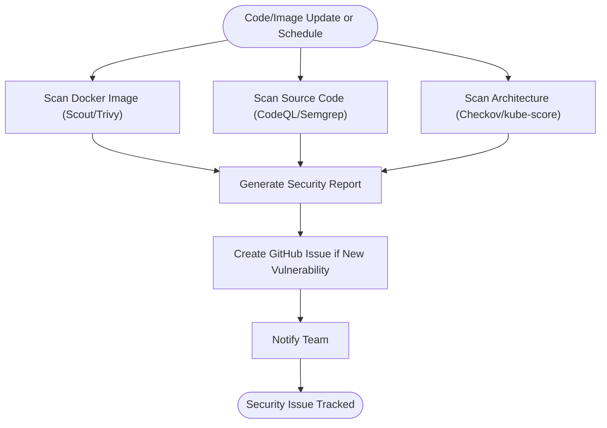
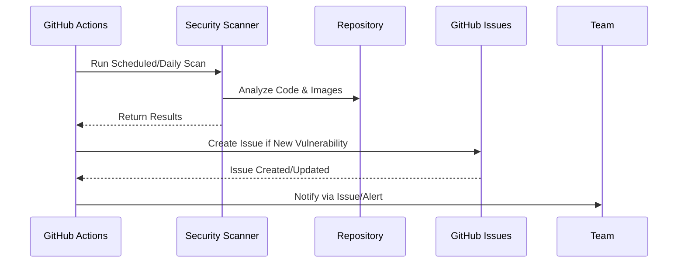

# SecOps Automation: Security Scanning & Reporting

## Summary
Implement automated security operations (SecOps) for the LLM proxy project, including Docker image scanning, source code security analysis, and automated reporting of new vulnerabilities via GitHub Actions.

## Rationale
- Proactive security scanning is essential for production readiness and compliance.
- Automated workflows ensure vulnerabilities are detected and reported promptly, reducing risk and manual effort.
- Using industry-standard tools (e.g., Docker Scout, Trivy, CodeQL) ensures best-in-class coverage and reliability.

## Tasks
- [ ] Set up Docker image security scanning in GitHub Actions (e.g., Docker Scout, Trivy)
- [ ] Schedule daily security scans of Docker images via GitHub Actions
- [ ] Configure workflow to automatically create a new GitHub issue if new vulnerabilities are found
- [ ] Integrate source code security scanning (e.g., GitHub CodeQL, Semgrep)
- [ ] Add architectural security analysis using industry-standard tools (e.g., Checkov for IaC, kube-score for Kubernetes manifests)
- [ ] Document all security scanning workflows and how to interpret results
- [ ] Add tests to ensure security workflows are triggered and reporting as expected

## Acceptance Criteria
- Docker images are scanned daily for vulnerabilities; new issues are created automatically for new findings
- Source code and infrastructure are scanned for security issues using industry-standard tools
- All security scanning workflows are documented and tested
- Security issues are tracked and resolved promptly 