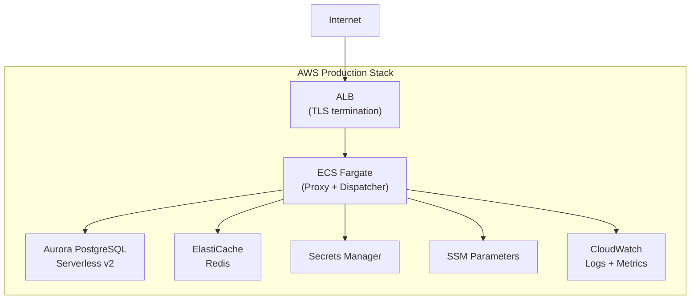

# AWS ECS Production Deployment with CDK

Tracking: [Issue #46](https://github.com/sofatutor/llm-proxy/issues/46)

## Summary

Deploy the LLM Proxy to AWS using a production-grade infrastructure stack built with **AWS CDK (TypeScript)**. This includes ECS Fargate for compute, Aurora PostgreSQL for database, ElastiCache Redis for caching/event bus, and all supporting AWS services for a secure, scalable, and observable deployment.

**Architecture Document**: [docs/architecture/planned/aws-ecs-cdk.md](../../architecture/planned/aws-ecs-cdk.md)

## Rationale

- **ECS Fargate**: Serverless containers eliminate EC2 management overhead
- **Aurora Serverless v2**: Auto-scaling PostgreSQL compatible with existing goose migrations
- **ElastiCache Redis**: Supports both HTTP response caching and Redis event bus
- **CDK (TypeScript)**: Type-safe, testable infrastructure-as-code
- **Multi-AZ**: High availability with automatic failover

## AWS Services Used

| Category | Service | Purpose |
|----------|---------|---------|
| Compute | ECS Fargate | Proxy and Dispatcher containers |
| Database | Aurora PostgreSQL Serverless v2 | Primary datastore |
| Cache | ElastiCache Redis | HTTP cache + event bus |
| Load Balancing | ALB | TLS termination, health checks, routing |
| Secrets | Secrets Manager | MANAGEMENT_TOKEN, DB credentials |
| Config | SSM Parameter Store | Non-sensitive configuration |
| DNS | Route 53 | Domain management |
| TLS | ACM | Certificate management |
| Observability | CloudWatch + X-Ray | Logs, metrics, tracing |
| Container Registry | ECR | Private Docker registry |

## Tasks

### Phase 1: CDK Foundation
- [ ] Initialize CDK project with TypeScript (`infra/` directory)
- [ ] Implement `VpcStack` (VPC, subnets, NAT gateways, security groups)
- [ ] Implement `SecretsStack` (Secrets Manager + SSM parameters)
- [ ] Set up GitHub Actions workflow for CDK deployment

### Phase 2: Data Layer
- [ ] Implement `DataStack` (Aurora PostgreSQL Serverless v2)
- [ ] Implement ElastiCache Redis cluster with encryption
- [x] Enable PostgreSQL driver in llm-proxy codebase (completed in Phase 5)
- [ ] Add TLS support for Redis connections (`rediss://`)
- [ ] Test database migrations with Aurora

### Phase 3: Compute Layer
- [ ] Implement `EcsStack` (Fargate cluster, task definitions, services)
- [ ] Configure Proxy service (2-10 tasks, auto-scaling)
- [ ] Configure Dispatcher service (1-2 tasks)
- [ ] Set up container health checks with DB/Redis connectivity
- [ ] Configure auto-scaling policies (CPU + request count)

### Phase 4: Networking & Security
- [ ] Implement `AlbStack` (ALB, target groups, listeners)
- [ ] Configure TLS certificates with ACM
- [ ] Set up Route 53 DNS records
- [ ] Configure path-based routing (proxy vs admin)
- [ ] Implement WAF rules (optional)
- [ ] Security audit and IAM policy review

### Phase 5: Observability
- [ ] Implement `ObservabilityStack` (CloudWatch dashboards)
- [ ] Configure log groups with retention policies
- [ ] Set up CloudWatch alarms (error rate, latency, connections)
- [ ] Enable X-Ray distributed tracing
- [ ] Configure SNS topics for alerting

### Phase 6: Production Readiness
- [ ] Load testing and performance tuning
- [ ] Disaster recovery testing (AZ failover)
- [ ] Create operational runbooks
- [ ] Document deployment process
- [ ] Production deployment checklist

## Code Changes Required

1. **PostgreSQL Driver**: Enable PostgreSQL support (already planned in Phase 5)
2. **Redis TLS**: Support `rediss://` URL scheme for transit encryption
3. **Health Check Enhancement**: Include DB/Redis connectivity in `/health`
4. **Graceful Shutdown**: Handle SIGTERM, drain connections, flush event bus
5. **Environment Variables**: Support AWS-native configuration patterns

## Acceptance Criteria

- [ ] CDK stacks deploy successfully to AWS account
- [ ] Proxy service runs with 2+ tasks across multiple AZs
- [ ] Database migrations run successfully against Aurora
- [ ] HTTP caching works with ElastiCache Redis
- [ ] Event bus works with ElastiCache Redis
- [ ] ALB health checks pass consistently
- [ ] Auto-scaling responds to load changes
- [ ] CloudWatch dashboards show key metrics
- [ ] Alarms trigger on error conditions
- [ ] All secrets managed via Secrets Manager (no plaintext)
- [ ] Documentation covers deployment and operations

## Cost Estimate

| Configuration | Monthly Cost | Notes |
|--------------|--------------|-------|
| **Low Traffic (default)** | **~$130** | Single NAT, 1 proxy task, 0.5 ACU Aurora, no Redis replica |
| Medium | ~$150-200 | 1-2 proxy tasks, auto-scaling |
| Production | ~$300-400 | 2 NATs, 2+ proxy tasks, Redis replica |
| High Scale | ~$600+ | Full HA, Container Insights, X-Ray |

**Key Cost Optimizations Applied**:
- ARM64 Fargate (~20% savings)
- Single NAT Gateway (~$32/mo savings)
- Single Redis node (~$12/mo savings)
- Aurora Serverless v2 scales to 0.5 ACU
- ACM certificates are **free**

## Related Issues

- [Phase 5: PostgreSQL Support](../done/phase-5-postgres-support.md) ✅
- [Phase 6: Kubernetes/Helm](phase-6-kubernetes-helm.md)
- [Phase 7: AWS EventBridge Connector](../backlog/phase-7-aws-eventbridge-connector.md) 