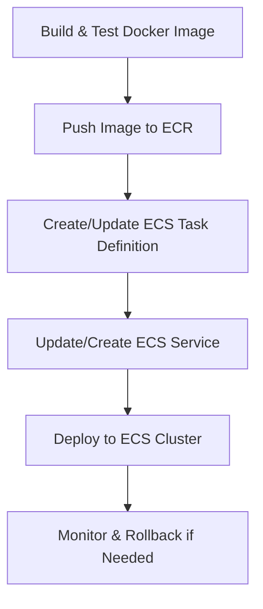

# AWS ECS Deployment

Tracking: [Issue #46](https://github.com/sofatutor/llm-proxy/issues/46)

## Summary
Document and implement deployment of the LLM proxy to AWS ECS using AWS CDK (TypeScript), including containerization, task definition, service setup, and CI/CD integration.

## Rationale
- AWS ECS enables scalable, reliable, and managed container deployments in the AWS ecosystem.
- Infrastructure-as-code via CDK ensures repeatability and reviewability.
- Proper secrets management and deployment testing are critical for security and stability.

## Tasks
- [ ] Create ECS task definitions and service configuration for the LLM proxy (CDK)
- [ ] Implement secrets management using AWS Secrets Manager or SSM Parameter Store (CDK)
- [ ] Set up logging, health checks, and autoscaling in ECS (CDK)
- [ ] Test ECS deployment for functionality, reliability, and scaling
- [ ] Document AWS ECS deployment process and best practices

## Acceptance Criteria
- ECS task and service configs are available as AWS CDK stacks and tested
- Secrets management is implemented and documented via CDK
- CloudWatch logging, health checks, and autoscaling are configured via CDK
- Documentation and tests are updated accordingly 