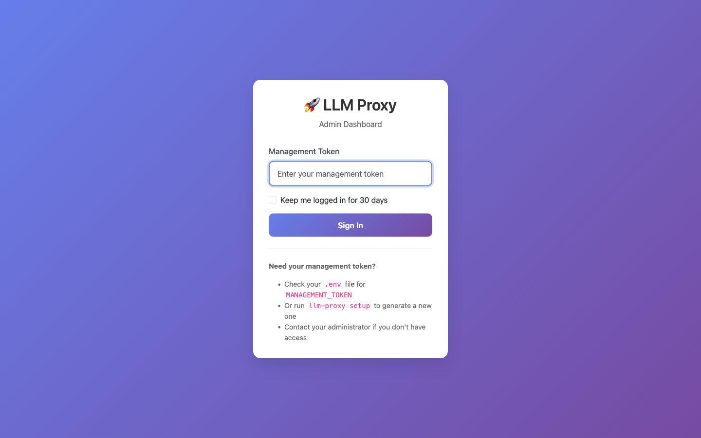
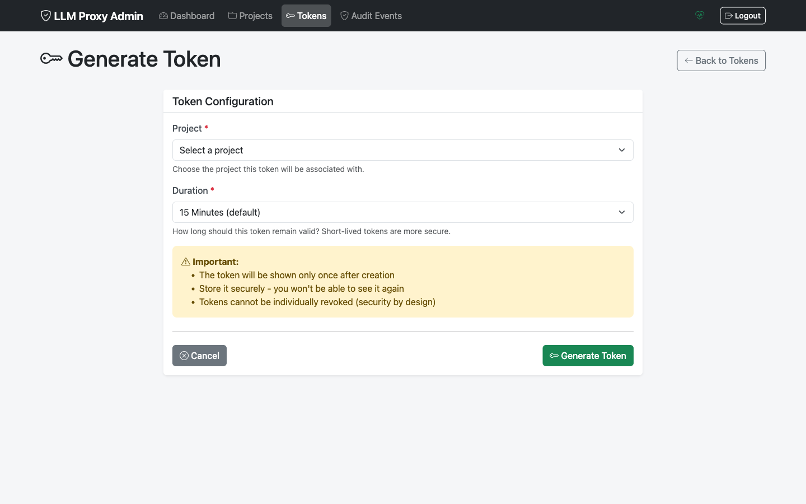
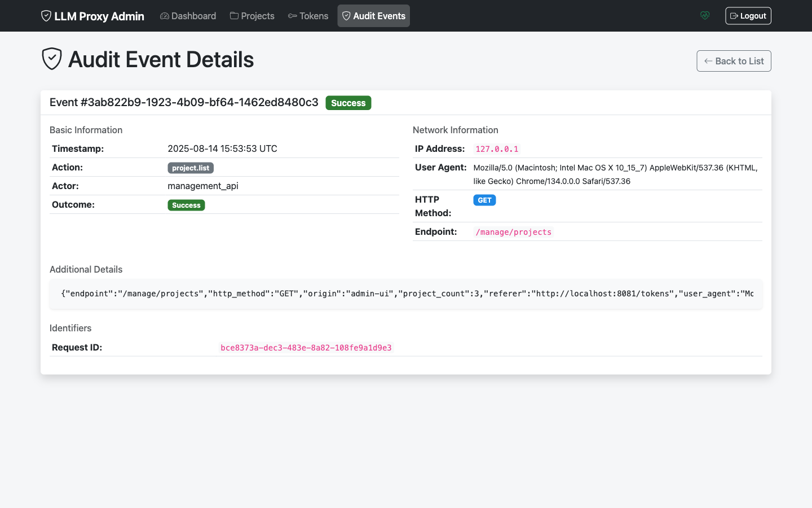

[Home](./index.md) | [Features](./features.md) | [Screenshots](./screenshots.md) | [Quickstart](./quickstart.md) | [CLI Reference](./cli-reference.md) | [Architecture](./architecture.md) | [Contributing](./contributing.md) | [Coverage](./coverage/) | [Roadmap](../PLAN.md)

## Screenshots

> The following screenshots illustrate key Admin UI flows. Images are optimized and stored under `docs/assets/screenshots/`.

### Login

### Dashboard

### Projects

### Project Create

### Project Show

### Tokens

### Token Create

### Token Created

### Audit

### Audit Detail

