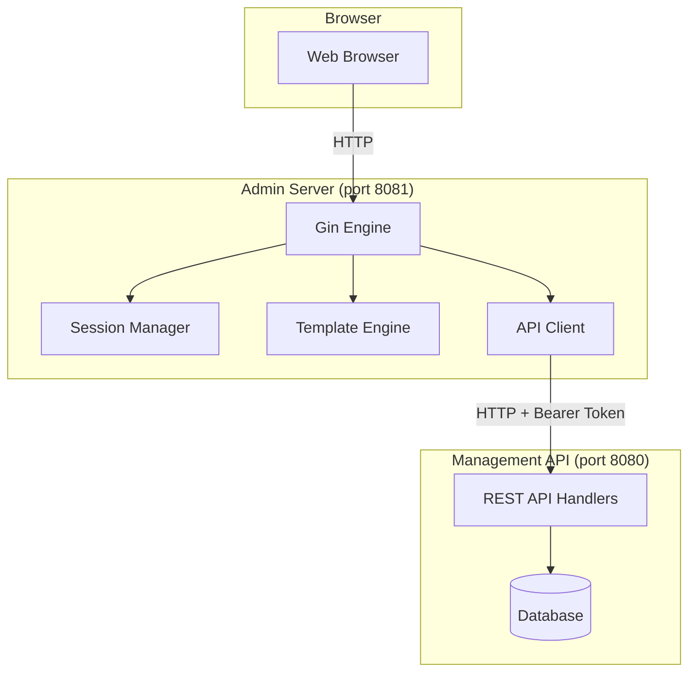
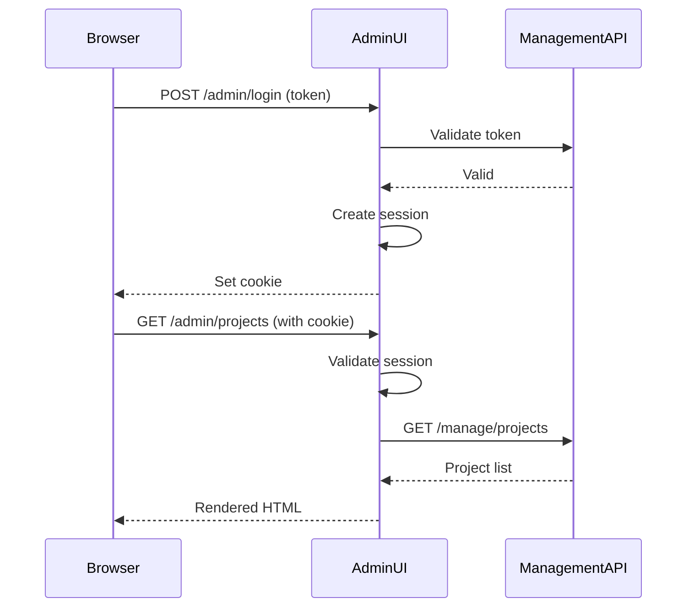

# Admin Package

## Purpose & Responsibilities

The `admin` package provides a web-based administration interface for the LLM Proxy. It handles:

- **Web UI Server**: Separate HTTP server with Gin framework for admin interface
- **Session Management**: Cookie-based sessions with configurable expiration
- **Management API Client**: HTTP client for communicating with the Management API
- **Dashboard**: Overview of projects, tokens, and system statistics
- **Project Management**: CRUD operations for projects via web interface
- **Token Management**: Create, list, view, and revoke tokens
- **Audit Log Viewer**: Browse and search security audit events
- **Template Rendering**: Server-side HTML templates with helper functions

## Architecture



### Two-Server Architecture

The admin package runs as a **separate HTTP server** from the main proxy:

| Server | Port | Purpose | Authentication |
|--------|------|---------|----------------|
| **Main Proxy** | 8080 | API proxying, Management API | Bearer token in headers |
| **Admin UI** | 8081 | Web interface | Cookie-based sessions |

This separation provides:
- Independent deployment and scaling
- Different security models (cookies vs. bearer tokens)
- Isolated failure domains

## Key Types & Interfaces

| Type | Description |
|------|-------------|
| `Server` | Main admin server struct with Gin engine and API client |
| `APIClient` | HTTP client for Management API communication |
| `APIClientInterface` | Interface for API client (enables mocking in tests) |
| `Session` | User session with authentication state |
| `Project` | Project data model (mirrors Management API) |
| `Token` | Token data model with obfuscation for display |
| `AuditEvent` | Audit log entry for display |
| `DashboardData` | Aggregated dashboard statistics |

### Constructor Functions

| Function | Description |
|----------|-------------|
| `NewServer(cfg)` | Creates admin server with configuration |
| `NewAPIClient(baseURL, token)` | Creates Management API client |

## Session Management

The admin UI uses **cookie-based sessions** for user authentication:



### Session Features

| Feature | Behavior |
|---------|----------|
| Storage | Cookie-based with encrypted session data |
| Expiration | 24 hours (default session), 30 days (remember me) |
| Security | HMAC-signed cookies using management token + salt |
| Logout | Session invalidation + cookie deletion |

## API Client Usage

The `APIClient` wraps HTTP calls to the Management API:

### Example: Creating a Token

```go
client := admin.NewAPIClient("http://localhost:8080", managementToken)

// Create token with 60-minute expiration and no request limit
response, err := client.CreateToken(ctx, projectID, 60, nil)
if err != nil {
    // Handle error
}

fmt.Println("New token:", response.Token)
fmt.Println("Expires at:", response.ExpiresAt)
```

### Example: Listing Projects

```go
projects, pagination, err := client.GetProjects(ctx, page, pageSize)
if err != nil {
    // Handle error
}

for _, project := range projects {
    fmt.Printf("Project: %s (%s)\n", project.Name, project.ID)
}
```

### Context Propagation

The API client forwards browser metadata to the Management API for audit logging:

| Context Key | Header | Purpose |
|-------------|--------|---------|
| `ctxKeyForwardedUA` | `X-Forwarded-User-Agent` | Browser user agent |
| `ctxKeyForwardedReferer` | `X-Forwarded-Referer` | Originating page |
| `ctxKeyForwardedIP` | `X-Forwarded-For` | Client IP address |

## Web UI Routes

### Authentication

| Route | Method | Description |
|-------|--------|-------------|
| `/admin/login` | GET, POST | Login page and authentication |
| `/admin/logout` | POST | Logout and session termination |

### Dashboard & Projects

| Route | Method | Description |
|-------|--------|-------------|
| `/admin` | GET | Dashboard overview |
| `/admin/projects` | GET | Project list |
| `/admin/projects/new` | GET, POST | Create project form |
| `/admin/projects/:id` | GET | Project details |
| `/admin/projects/:id/edit` | GET, POST | Edit project |
| `/admin/projects/:id/delete` | POST | Delete project |

### Tokens

| Route | Method | Description |
|-------|--------|-------------|
| `/admin/tokens` | GET | Token list (all or filtered by project) |
| `/admin/tokens/new` | GET, POST | Create token form |
| `/admin/tokens/:id` | GET | Token details |
| `/admin/tokens/:id/edit` | GET, POST | Edit token |
| `/admin/tokens/:id/revoke` | POST | Revoke token |
| `/admin/projects/:projectID/tokens/revoke-all` | POST | Revoke all project tokens |

### Audit Logs

| Route | Method | Description |
|-------|--------|-------------|
| `/admin/audit` | GET | Audit log list with filters |
| `/admin/audit/:id` | GET | Audit event details |

### Static Assets

| Route | Purpose |
|-------|---------|
| `/static/*` | CSS, JavaScript, images |

## Configuration

### Environment Variables

| Variable | Description | Default |
|----------|-------------|---------|
| `ADMIN_UI_ENABLED` | Enable Admin UI server | `true` |
| `ADMIN_UI_LISTEN_ADDR` | Admin server address | `:8081` |
| `ADMIN_UI_API_BASE_URL` | Management API base URL | `http://localhost:8080` |
| `ADMIN_UI_TEMPLATE_DIR` | Path to HTML templates | `web/templates` |
| `MANAGEMENT_TOKEN` | Token for Management API | Required |

### AdminUIConfig Options

| Field | Description | Default |
|-------|-------------|---------|
| `Enabled` | Enable admin server | `true` |
| `ListenAddr` | Listen address | `:8081` |
| `APIBaseURL` | Management API URL | `http://localhost:8080` |
| `ManagementToken` | API authentication token | Required |
| `TemplateDir` | Template directory | `web/templates` |

## Template System

The admin UI uses Go's `html/template` package with custom helper functions:

### Template Structure

```
web/templates/
├── layouts/
│   └── base.html         # Base layout with header/footer
├── dashboard/
│   └── index.html        # Dashboard page
├── projects/
│   ├── list.html         # Project list
│   ├── show.html         # Project details
│   └── form.html         # Create/edit form
├── tokens/
│   ├── list.html         # Token list
│   ├── show.html         # Token details
│   └── form.html         # Create token form
└── audit/
    ├── list.html         # Audit log list
    └── show.html         # Event details
```

### Custom Template Functions

| Function | Description |
|----------|-------------|
| `stringOr` | Return a string value or a fallback for `*string`/`string` |
| `add`, `sub`, `inc`, `dec` | Basic arithmetic helpers |
| `safeSub` | Subtract with floor at 0 |
| `formatMaxRequests` | Format a max-requests value (`∞` when nil/<=0) |
| `seq`, `pageRange` | Generate integer ranges for loops/pagination |
| `obfuscateToken` | Obfuscate tokens for display (UI-oriented) |
| `obfuscateAPIKey` | Obfuscate API keys for display |
| `formatRFC3339UTC`, `formatRFC3339UTCPtr` | Format timestamps as RFC3339Nano UTC strings |

See `server.go` for the full list of available template functions.

## Usage Examples

### Starting the Admin Server

```go
package main

import (
    "github.com/sofatutor/llm-proxy/internal/admin"
    "github.com/sofatutor/llm-proxy/internal/config"
)

func main() {
    cfg, err := config.New()
    if err != nil {
        panic(err)
    }

    server, err := admin.NewServer(cfg)
    if err != nil {
        panic(err)
    }

    if err := server.Start(); err != nil {
        panic(err)
    }
}
```

### Custom API Client Usage

```go
// Create client
client := admin.NewAPIClient(
    "http://localhost:8080",
    "your-management-token",
)

// Get dashboard data
ctx := context.Background()
dashboard, err := client.GetDashboardData(ctx)
if err != nil {
    log.Fatal(err)
}

fmt.Printf("Projects: %d\n", dashboard.TotalProjects)
fmt.Printf("Tokens: %d\n", dashboard.TotalTokens)
```

### Token Obfuscation

```go
// Obfuscate token for display
token := "sk-AYB2gH5xQZ1234567890ab"
obfuscated := admin.ObfuscateToken(token)
// Output: "sk-AYB2g...90ab"

// Obfuscate API key
apiKey := "sk-proj-1234567890abcdefghijklmnopqrstuvwxyz"
obfuscated := admin.ObfuscateAPIKey(apiKey)
// Output: "sk-proj-...wxyz"
```

Note: HTML templates use the `obfuscateToken` and `obfuscateAPIKey` template helpers. The token helper is UI-oriented and may use a different obfuscation strategy than `admin.ObfuscateToken`.

## Troubleshooting

### Common Issues

| Symptom | Cause | Solution |
|---------|-------|----------|
| Cannot access admin UI | Server not started or wrong port | Check `ADMIN_UI_LISTEN_ADDR` and logs |
| Login fails | Invalid management token | Verify `MANAGEMENT_TOKEN` matches |
| API calls fail | Management API unreachable | Check `ADMIN_UI_API_BASE_URL` |
| Templates not found | Wrong template directory | Verify `ADMIN_UI_TEMPLATE_DIR` path |
| Session expires immediately | Cookie not set | Check browser cookie settings |

### Debug Headers

Response headers for debugging:

| Header | Description |
|--------|-------------|
| `X-Request-ID` | Unique request identifier |
| `X-Admin-Session` | Session ID (if authenticated) |

## Related Packages

| Package | Relationship |
|---------|--------------|
| [`server`](../server/README.md) | Management API that admin UI calls |
| [`api`](../api/) | API handler implementations |
| [`config`](../config/README.md) | Admin UI configuration |
| [`audit`](../audit/README.md) | Audit event display |
| [`logging`](../logging/README.md) | Application logging |

## Files

| File | Description |
|------|-------------|
| `server.go` | Main server implementation with routes and handlers |
| `client.go` | Management API HTTP client |
| `testdata/` | Minimal HTML templates for testing |

## Testing Strategy

### Goals
- Achieve and maintain **90%+ code coverage** for all admin server logic.
- Cover all HTTP handlers, error branches, and template rendering code paths.
- Ensure tests are robust to changes in working directory and template locations.

### Test Data
- Minimal HTML templates for all routes are in `internal/admin/testdata/`.
- Tests use a helper (`testTemplateDir()`) to resolve the correct path for templates, making tests CWD-agnostic.

### Adding/Updating Tests
- For each new handler or feature, add a corresponding test in `server_test.go`.
- If a handler renders a new template, add a minimal HTML file to `testdata/`.
- Use table-driven tests for logic with multiple input/output cases.
- Use mock API clients to isolate handler logic from external dependencies.

### Running Tests
- Run all tests and check coverage with:
  ```sh
  make test-coverage
  # or
  go test -cover ./internal/admin/...
  ```

### Coverage Enforcement
- PRs are not merged unless coverage is **90%+**.
- Coverage is checked in CI and locally.

### Special Conventions
- Template path resolution is handled by a helper to ensure tests work regardless of CWD.
- Minimal templates are used to satisfy the loader and cover template parsing code paths.

### Troubleshooting
- If tests fail due to missing templates, ensure all required files exist in `testdata/`.
- If coverage drops, check for untested error branches or new code.
