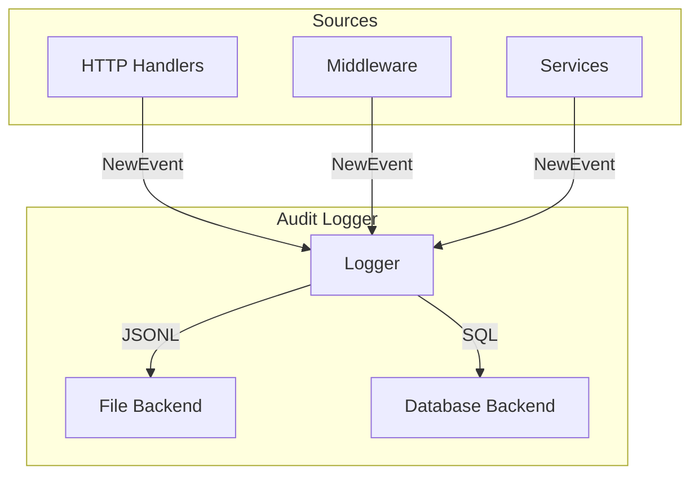
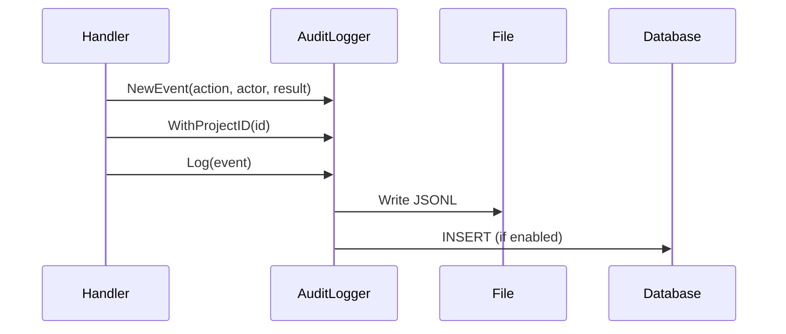

# Audit Package

Audit logging functionality for security-sensitive events in the LLM proxy, with immutable semantics for compliance.

## Purpose & Responsibilities

- **Security Event Tracking**: Records security-sensitive operations (token lifecycle, project management, proxy access)
- **Immutable Audit Trail**: Write-once semantics for compliance requirements
- **Dual Backend Support**: Writes to both file (JSONL) and database
- **Standardized Event Schema**: Canonical fields for consistent audit analysis
- **Token Obfuscation**: Automatically redacts sensitive token data

## Relationship to Application Logging

| Aspect | Application Logging | Audit Logging |
|--------|--------------------|--------------| 
| Purpose | Debugging, monitoring | Security, compliance |
| Events | All operations | Security-sensitive only |
| Retention | Rotated regularly | Long-term retention |
| Modification | Can be filtered/suppressed | Immutable records |
| Package | `internal/logging` | `internal/audit` |

## Configuration Options

| Environment Variable | Description | Default |
|---------------------|-------------|---------|
| `AUDIT_LOG_PATH` | Path to audit log file | Required |
| `AUDIT_DB_ENABLED` | Enable database audit storage | `false` |

## Event Schema

| Field | Type | Description |
|-------|------|-------------|
| `Timestamp` | `time.Time` | When event occurred |
| `Action` | `string` | Operation type (e.g., `token.create`) |
| `Actor` | `string` | Who performed action |
| `ProjectID` | `string` | Affected project |
| `RequestID` | `string` | Request correlation |
| `CorrelationID` | `string` | Distributed tracing |
| `ClientIP` | `string` | Client IP address |
| `Result` | `ResultType` | `success`, `failure`, `denied`, `error` |
| `Details` | `map[string]any` | Additional context |

## Action Categories

### Token Lifecycle Actions

| Action | Description |
|--------|-------------|
| `token.create` | New token created |
| `token.read` | Token details accessed |
| `token.update` | Token modified |
| `token.revoke` | Single token revoked |
| `token.revoke_batch` | Multiple tokens revoked |
| `token.delete` | Token deleted |
| `token.list` | Token listing accessed |
| `token.validate` | Token validation attempted |
| `token.access` | Token used for API access |

### Project Lifecycle Actions

| Action | Description |
|--------|-------------|
| `project.create` | New project created |
| `project.read` | Project details accessed |
| `project.update` | Project modified |
| `project.delete` | Project deleted |
| `project.list` | Project listing accessed |

### Other Actions

| Action | Description |
|--------|-------------|
| `proxy_request` | API request proxied (denied/error) |
| `admin.login` | Admin UI login |
| `admin.logout` | Admin UI logout |
| `admin.access` | Admin resource accessed |
| `audit.list` | Audit log listing |
| `cache.purge` | Cache purge operation |

## Actor Types

| Actor | Description |
|-------|-------------|
| `system` | Automated system operations |
| `anonymous` | Unauthenticated operations |
| `admin` | Admin UI operations |
| `management_api` | Management API operations |
| Token ID | API operations (auto-obfuscated) |

## Architecture



## Event Builder Methods

Events are created using a fluent builder pattern:

| Method | Description |
|--------|-------------|
| `NewEvent(action, actor, result)` | Create new event |
| `WithProjectID(id)` | Set project ID |
| `WithRequestID(id)` | Set request ID |
| `WithCorrelationID(id)` | Set correlation ID |
| `WithClientIP(ip)` | Set client IP |
| `WithTokenID(token)` | Set token (auto-obfuscated) |
| `WithError(err)` | Add error details |
| `WithUserAgent(ua)` | Add user agent |
| `WithHTTPMethod(method)` | Add HTTP method |
| `WithEndpoint(path)` | Add endpoint path |
| `WithDuration(d)` | Add operation duration |
| `WithReason(reason)` | Add reason/description |
| `WithDetail(key, value)` | Add custom detail |

## File Output Format

Audit events are written as JSON Lines (JSONL):

```json
{"timestamp":"2024-01-15T10:30:45Z","action":"token.create","actor":"management_api","project_id":"proj-123","result":"success"}
{"timestamp":"2024-01-15T10:31:00Z","action":"proxy_request","actor":"sk-ab...89","result":"denied","details":{"reason":"project_inactive"}}
```

## Integration Flow



## Security Considerations

1. **Token Obfuscation**: Always use `WithTokenID()` to ensure tokens are obfuscated
2. **No Secrets in Details**: Never add raw secrets to the `Details` map
3. **File Permissions**: Audit log files are created with `0644` permissions
4. **Sync on Write**: Each event triggers a file sync for durability

## Testing Guidance

- **Unit Tests**: Use `audit.NewNullLogger()` to discard events during tests
- **Event Content**: Create events with `NewEvent()` and assert field values
- **File Output**: Use `t.TempDir()` for testing file-based logging
- **Existing Tests**: See `logger_test.go`, `schema_test.go` for examples

## Related Documentation

- [Logging Package](../logging/README.md) - Application logging (separate from audit)
- [Database Package](../database/README.md) - Database storage for audit events
- [Instrumentation Guide](../../docs/instrumentation.md) - Complete observability documentation

## Files

| File | Description |
|------|-------------|
| `logger.go` | Audit logger implementation with file and database backends |
| `schema.go` | Event struct, action constants, result types, and builder methods |
