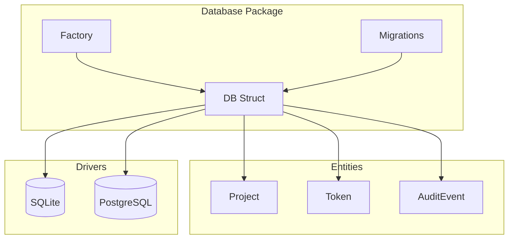
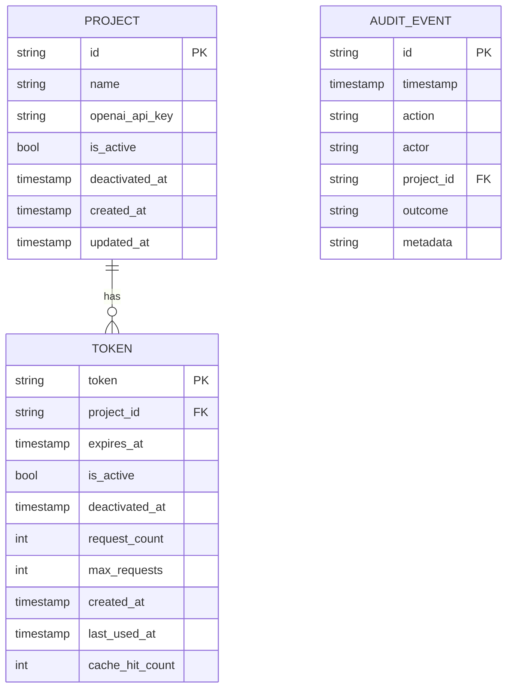
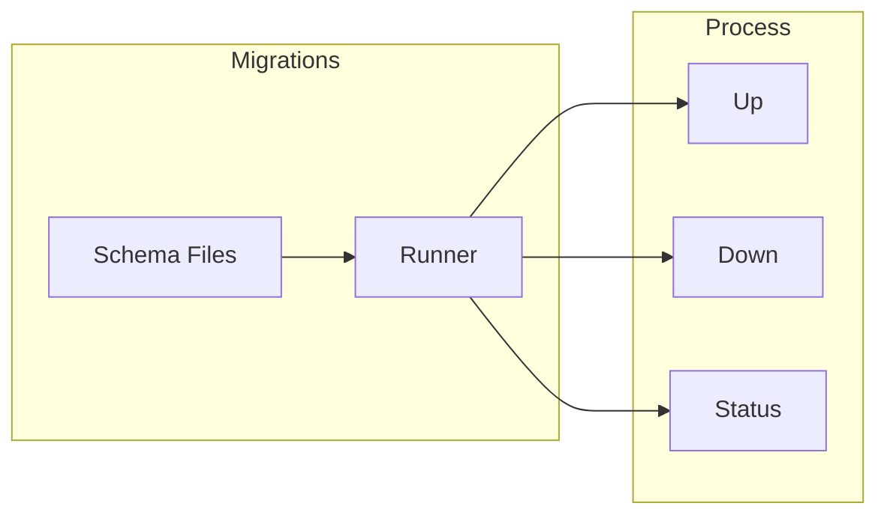

# Database Package

## Purpose & Responsibilities

The `database` package provides data persistence for the LLM Proxy. It handles:

- Database connection management and configuration
- Token and project CRUD operations
- Audit event storage and retrieval
- Database migrations using goose
- Support for SQLite (default) and PostgreSQL
- Connection pooling and transaction management

## Architecture

## Data Model

## Key Types & Interfaces

| Type | Description |
|------|-------------|
| `DB` | Main database connection wrapper |
| `Config` | SQLite-specific configuration |
| `FullConfig` | Multi-driver configuration (SQLite + PostgreSQL) |
| `Project` | Project entity model |
| `Token` | Token entity model |
| `AuditEvent` | Audit log entry model |
| `DriverType` | Database driver enum (SQLite, Postgres) |

### Constructor Functions

| Function | Description |
|----------|-------------|
| `New(config)` | Creates SQLite database connection |
| `NewFromFullConfig(config)` | Creates database with driver selection |
| `ConfigFromEnv()` | Loads configuration from environment |

### Operations

The `DB` struct provides CRUD operations for all entities:

| Category | Methods |
|----------|---------|
| Connection | `Close()`, `HealthCheck()`, `Transaction()` |
| Projects | `CreateProject()`, `GetProjectByID()`, `UpdateProject()`, `DeleteProject()`, `ListProjects()` |
| Tokens | `CreateToken()`, `GetTokenByID()`, `UpdateToken()`, `DeleteToken()`, `ListTokens()`, `IncrementTokenUsage()` |
| Audit | `CreateAuditEvent()`, `GetAuditEventByID()`, `ListAuditEvents()` |

## Configuration

### SQLite Configuration

| Field | Description | Default |
|-------|-------------|---------|
| `Path` | Database file path | `data/llm-proxy.db` |
| `MaxOpenConns` | Max open connections | 10 |
| `MaxIdleConns` | Max idle connections | 5 |
| `ConnMaxLifetime` | Connection max lifetime | 1 hour |

### Environment Variables

| Variable | Description | Default |
|----------|-------------|---------|
| `DB_DRIVER` | Database driver (`sqlite`, `postgres`) | `sqlite` |
| `DATABASE_PATH` | SQLite database path | `data/llm-proxy.db` |
| `DATABASE_URL` | PostgreSQL connection URL | - |
| `DATABASE_POOL_SIZE` | Max open connections | 10 |
| `DATABASE_MAX_IDLE_CONNS` | Max idle connections | 5 |
| `DATABASE_CONN_MAX_LIFETIME` | Connection lifetime | 1h |

### SQLite vs PostgreSQL

| Feature | SQLite | PostgreSQL |
|---------|--------|------------|
| Setup | Zero configuration | Requires server |
| Concurrency | Single writer | Multiple writers |
| Use case | Development, single instance | Production, multi-instance |
| Connection string | File path | URL with credentials |

## Migration Workflow

Migrations are managed using goose and stored in `migrations/sql/`:

| Migration | Description |
|-----------|-------------|
| `00001_initial_schema.sql` | Creates projects, tokens, and audit_events tables |
| `00002_add_deactivation_columns.sql` | Adds deactivation tracking |
| `00003_add_cache_hit_count.sql` | Adds cache hit tracking |

Migrations run automatically on `New()`. See `internal/database/migrations/README.md` for manual commands.

## Testing Guidance

- Use in-memory SQLite (`Config{Path: ":memory:"}`) for unit tests
- Use `MockProjectStore` and `MockTokenStore` for isolated testing
- See `*_test.go` files for comprehensive test patterns
- Set `MaxOpenConns = 1` for in-memory database tests

## Troubleshooting

### Common Errors

| Error | Cause | Solution |
|-------|-------|----------|
| `failed to create database directory` | Parent directory doesn't exist | Create directory or use absolute path |
| `failed to open database` | Invalid path or permissions | Check file permissions |
| `failed to run migrations` | Migration files not found | Verify migrations directory path |
| `database is locked` | Concurrent writes (SQLite) | Use PostgreSQL for concurrent access |
| `ErrProjectNotFound` | Project doesn't exist | Check project ID |
| `ErrTokenNotFound` | Token doesn't exist | Check token ID |

### Connection Issues

| Symptom | Cause | Solution |
|---------|-------|----------|
| Connection timeouts | Pool exhaustion | Increase `MaxOpenConns` |
| Slow queries | Missing indexes | Check migration indexes |
| Memory growth | Connection leaks | Ensure `Close()` is called |

### SQLite-Specific Issues

| Symptom | Cause | Solution |
|---------|-------|----------|
| "database is locked" | Concurrent writes | Use WAL mode (enabled by default) |
| Slow writes | Missing WAL | Check connection string includes `?_journal=WAL` |
| Test failures | Shared in-memory DB | Use `MaxOpenConns = 1` for `:memory:` |

## Related Packages

| Package | Relationship |
|---------|--------------|
| [`token`](../token/README.md) | Uses TokenStore interface from database |
| [`proxy`](../proxy/README.md) | Uses ProjectStore interface from database |
| [`server`](../server/README.md) | Initializes database for API handlers |
| [`audit`](../audit/) | Stores audit events in database |

## Files

| File | Description |
|------|-------------|
| `database.go` | Core DB struct, connection, and migrations |
| `factory.go` | Multi-driver database factory |
| `factory_postgres.go` | PostgreSQL-specific factory |
| `models.go` | Data models (Project, Token, AuditEvent) |
| `project.go` | Project CRUD operations |
| `token.go` | Token CRUD operations |
| `audit.go` | Audit event operations |
| `utils.go` | Helper functions and query utilities |
| `mock_project.go` | Mock project store for testing |
| `mock_token.go` | Mock token store for testing |
| `migrations/` | Database migration files and runner |
