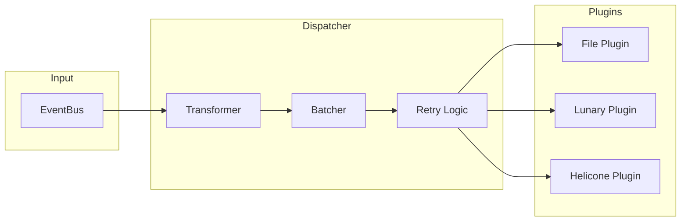
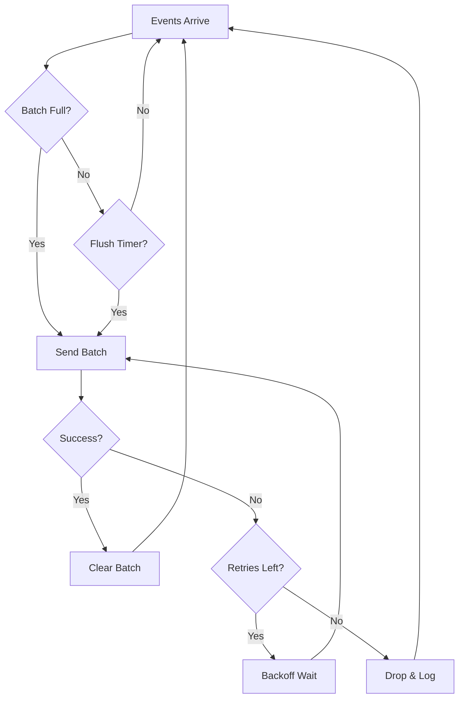
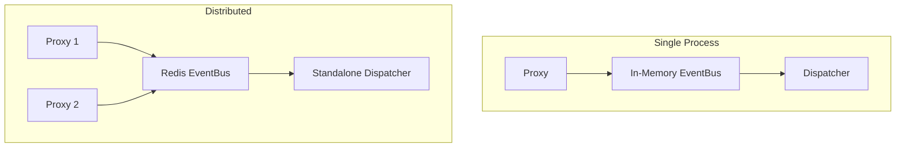

# Dispatcher Package

Pluggable event dispatcher service that consumes events from the event bus and forwards them to external observability platforms.

## Purpose & Responsibilities

- **Event Consumption**: Subscribes to the event bus and processes incoming events
- **Event Transformation**: Converts internal events to formats required by external services
- **Batching**: Groups events for efficient network transmission
- **Retry Logic**: Handles transient failures with exponential backoff
- **Plugin Architecture**: Supports multiple backend services via plugins

## Architecture



## Available Backend Plugins

| Plugin | Description | Use Case |
|--------|-------------|----------|
| **File** | Writes events to JSONL file | Local storage, debugging |
| **Lunary** | Sends to [Lunary.ai](https://lunary.ai) | LLM observability |
| **Helicone** | Sends to [Helicone](https://helicone.ai) | LLM analytics |

### Plugin Configuration

| Plugin | Key | Description | Required | Default |
|--------|-----|-------------|----------|---------|
| File | `endpoint` | File path for JSONL output | Yes | - |
| Lunary | `api-key` | Lunary API key | Yes | - |
| Lunary | `endpoint` | API endpoint URL | No | `https://api.lunary.ai/v1/runs/ingest` |
| Helicone | `api-key` | Helicone API key | Yes | - |
| Helicone | `endpoint` | API endpoint URL | No | `https://api.worker.helicone.ai/custom/v1/log` |

**Helicone-Specific Features**: Automatic provider detection, token usage injection, request ID propagation, non-JSON response handling (base64).

## Service Configuration

| Parameter | Description | Default |
|-----------|-------------|---------|
| `BufferSize` | Event bus buffer size | `1000` |
| `BatchSize` | Events per batch | `100` |
| `FlushInterval` | Max time between flushes | `5s` |
| `RetryAttempts` | Retry count on failure | `3` |
| `RetryBackoff` | Initial backoff duration | `1s` |
| `Plugin` | Backend plugin (required) | - |
| `PluginName` | Plugin name for offset tracking | - |
| `Verbose` | Include debug info in payloads | `false` |

## CLI Usage

```bash
# File output
llm-proxy dispatcher --service file --endpoint events.jsonl

# Lunary integration
llm-proxy dispatcher --service lunary --api-key $LUNARY_API_KEY

# Helicone integration
llm-proxy dispatcher --service helicone --api-key $HELICONE_API_KEY
```

### CLI Options

| Flag | Description | Default |
|------|-------------|---------|
| `--service` | Backend service (file, lunary, helicone) | `file` |
| `--endpoint` | API endpoint or file path | Service-specific |
| `--api-key` | API key for external services | - |
| `--buffer` | Event bus buffer size | `1000` |
| `--batch-size` | Batch size for sending events | `100` |
| `--detach` | Run in background (daemon mode) | `false` |

## Environment Variables

| Variable | Description | Default |
|----------|-------------|---------|
| `LLM_PROXY_API_KEY` | API key for selected service | - |
| `LLM_PROXY_ENDPOINT` | Default endpoint URL | - |
| `LLM_PROXY_EVENT_BUS` | Event bus backend (`memory` or `redis`) | `memory` |

## Batching and Retry Flow



**Retry Behavior**:
- Exponential backoff: `attempt * RetryBackoff`
- Permanent errors (HTTP 4xx) are not retried
- After all retries exhausted, batch is dropped and logged

## Event Transformation

The transformer converts `eventbus.Event` to `EventPayload` for external services.

**EventPayload fields**: `Type`, `Event`, `RunID`, `Timestamp`, `Input`, `Output`, `TokensUsage`, `Metadata`, `Tags`, `LogID`

**Key Functions**: `NewDefaultEventTransformer(verbose)`, `Transform(evt)`, implement `EventTransformer` interface for custom logic.

## Integration Patterns



## Testing Guidance

- **Unit Tests**: Create a mock implementing `BackendPlugin` interface to capture sent events
- **Transformer Tests**: Use `NewDefaultEventTransformer` with test events
- **Existing Tests**: See `service_test.go`, `transformer_test.go`, `plugins/plugins_test.go`

## Related Documentation

- [EventBus Package](../eventbus/README.md) - Event publishing and subscription
- [Instrumentation Guide](../../docs/observability/instrumentation.md) - Complete observability documentation

## Files

| File | Description |
|------|-------------|
| `service.go` | Main dispatcher service implementation |
| `plugin.go` | BackendPlugin interface and EventPayload struct |
| `transformer.go` | Event transformation logic |
| `errors.go` | Error types including PermanentBackendError |
| `plugins/registry.go` | Plugin factory registry |
| `plugins/file.go` | File backend plugin |
| `plugins/lunary.go` | Lunary.ai backend plugin |
| `plugins/helicone.go` | Helicone backend plugin |
