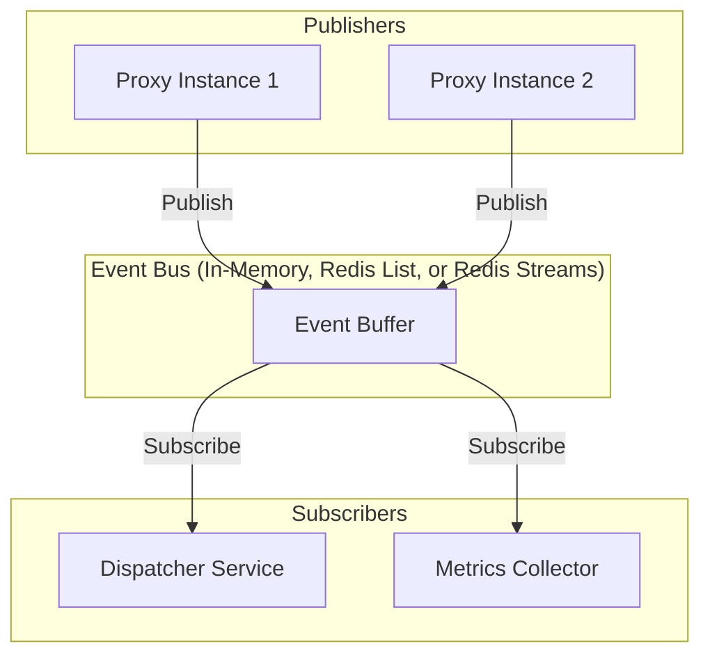
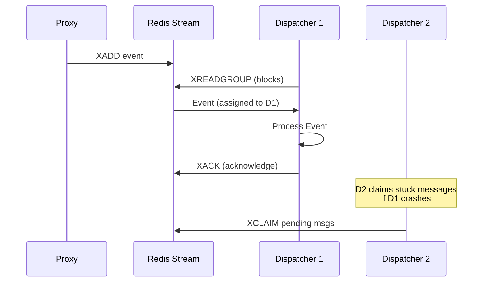
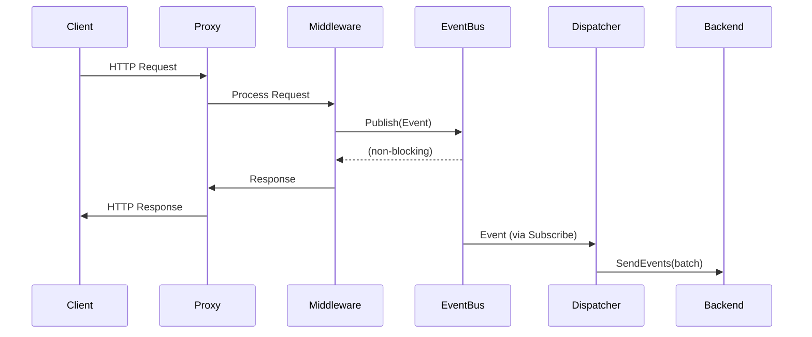

# EventBus Package

Asynchronous, non-blocking event bus for observability and instrumentation events in the LLM proxy.

## Purpose & Responsibilities

- **Non-blocking Event Publishing**: Events published asynchronously to avoid blocking request handling
- **Fan-out Broadcasting**: Multiple subscribers receive all published events
- **Backend Flexibility**: In-memory (single process), Redis List, or Redis Streams (distributed with consumer groups)
- **Graceful Degradation**: Buffer overflow drops events rather than blocking
- **Monotonic Event IDs**: Redis backend assigns sequential `LogID` values for ordering
- **At-least-once Delivery**: Redis Streams backend with consumer groups and acknowledgment

## Architecture

## Implementations

### In-Memory EventBus

Best for single-process deployments and local development.

| Feature | Behavior |
|---------|----------|
| Delivery | Single process only |
| Buffer | Configurable size (default: 1000) |
| Overflow | Events dropped (non-blocking) |
| Retry | Up to 3 retries with exponential backoff |
| Shutdown | Graceful close of subscriber channels |

**Key Functions**: `NewInMemoryEventBus(bufferSize)`, `Publish()`, `Subscribe()`, `Stop()`, `Stats()`

### Redis EventBus (List-based)

Best for distributed deployments where multiple processes share events with simple semantics.

| Feature | Behavior |
|---------|----------|
| Delivery | Distributed across processes |
| Storage | Redis LIST with JSON serialization |
| TTL | Configurable expiration |
| Trimming | Automatic via max length |
| Ordering | Monotonic `LogID` via Redis INCR |

**Key Functions**: `NewRedisEventBusPublisher()`, `NewRedisEventBusLog()`, `ReadEvents()`, `EventCount()`

### Redis Streams EventBus

Best for distributed deployments requiring durable, guaranteed delivery with consumer groups.

| Feature | Behavior |
|---------|----------|
| Delivery | At-least-once with acknowledgment |
| Storage | Redis Streams with JSON serialization |
| Consumer Groups | Multiple dispatcher instances share workload |
| Acknowledgment | XACK after successful processing |
| Pending Recovery | Claims stuck messages from crashed consumers |
| Trimming | Automatic via MaxLen (approximate) |
| Blocking Read | Configurable block timeout for efficiency |

**Key Functions**: `NewRedisStreamsEventBus()`, `Publish()`, `Subscribe()`, `Stop()`, `Acknowledge()`, `StreamLength()`, `PendingCount()`

#### Consumer Group Semantics

Redis Streams implements the competing consumers pattern:

1. **Publishing**: Events are added to stream via XADD
2. **Consuming**: Dispatchers read via XREADGROUP with consumer groups
3. **Acknowledgment**: Successfully processed messages are acknowledged with XACK
4. **Recovery**: Pending messages from crashed consumers are claimed via XCLAIM

## Event Schema

The `Event` struct captures HTTP request/response data for observability:

| Field | Type | Description |
|-------|------|-------------|
| `LogID` | `int64` | Monotonic event ID (Redis only) |
| `RequestID` | `string` | Unique request identifier |
| `Method` | `string` | HTTP method |
| `Path` | `string` | Request path |
| `Status` | `int` | Response status code |
| `Duration` | `time.Duration` | Request duration |
| `RequestBody` | `[]byte` | Request body |
| `ResponseBody` | `[]byte` | Response body |
| `ResponseHeaders` | `http.Header` | Response headers |

## Configuration Options

### General Options

| Environment Variable | Description | Default |
|---------------------|-------------|---------|
| `OBSERVABILITY_BUFFER_SIZE` | Event buffer size for in-memory bus | `1000` |
| `LLM_PROXY_EVENT_BUS` | Backend type: `in-memory`, `redis`, or `redis-streams` | `redis` |
| `REDIS_ADDR` | Redis server address | `localhost:6379` |
| `REDIS_DB` | Redis database number | `0` |

### Redis Streams Options

| Environment Variable | Description | Default |
|---------------------|-------------|---------|
| `REDIS_STREAM_KEY` | Stream key name | `llm-proxy-events` |
| `REDIS_CONSUMER_GROUP` | Consumer group name | `llm-proxy-dispatchers` |
| `REDIS_CONSUMER_NAME` | Consumer name (auto-generated if empty) | `` |
| `REDIS_STREAM_MAX_LEN` | Max stream length (0 = unlimited) | `10000` |
| `REDIS_STREAM_BLOCK_TIME` | Block timeout for XREADGROUP | `5s` |
| `REDIS_STREAM_CLAIM_TIME` | Min idle time before claiming pending messages | `30s` |
| `REDIS_STREAM_BATCH_SIZE` | Batch size for reading messages | `100` |

## Integration Flow

## Testing Guidance

- **Unit Tests**: Create a mock implementing `EventBus` interface to capture published events
- **Integration Tests**: Use `NewInMemoryEventBus` with small buffer size to test overflow behavior
- **Redis Streams Tests**: Use miniredis for integration testing with Redis Streams
- **Existing Tests**: See `eventbus_test.go` and `redis_streams_test.go` for comprehensive examples

## Related Documentation

- [Dispatcher Package](../dispatcher/README.md) - Event processing and backend delivery
- [Instrumentation Guide](../../docs/instrumentation.md) - Complete observability documentation

## Files

| File | Description |
|------|-------------|
| `eventbus.go` | Core interfaces, Event struct, In-Memory and Redis List implementations |
| `redis_streams.go` | Redis Streams implementation with consumer groups |
