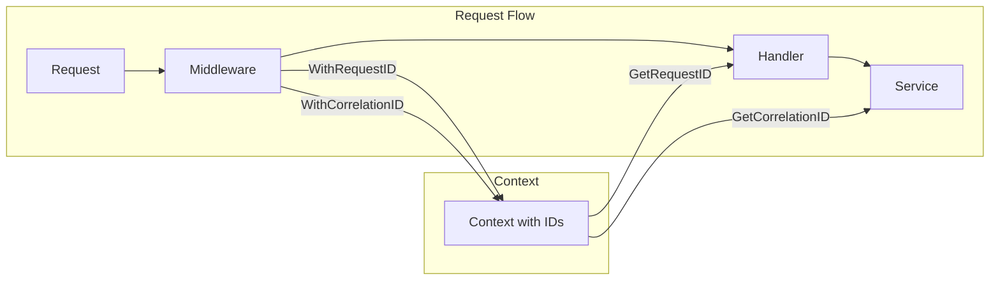
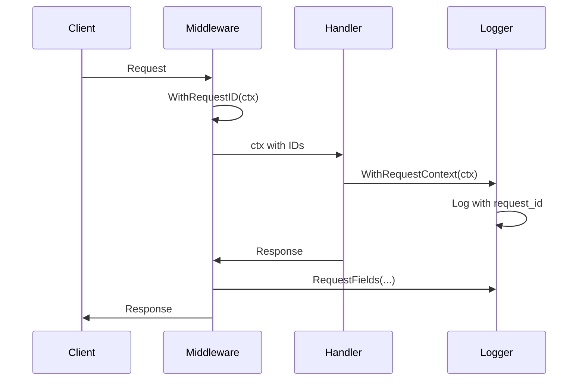

# Logging Package

Structured logging utilities for the LLM proxy, built on [Zap](https://github.com/uber-go/zap).

## Purpose & Responsibilities

- **Structured Logging**: JSON and console output formats via Zap
- **Canonical Fields**: Standardized field names for consistent log analysis
- **Context Propagation**: Request ID and correlation ID tracking
- **Log Level Filtering**: Configurable verbosity (debug, info, warn, error)
- **Output Routing**: Stdout or file-based log output

## Configuration Options

| Environment Variable | Description | Default |
|---------------------|-------------|---------|
| `LOG_LEVEL` | Minimum log level (`debug`, `info`, `warn`, `error`) | `info` |
| `LOG_FORMAT` | Output format (`json`, `console`) | `json` |
| `LOG_FILE` | File path for log output (empty = stdout) | - |

## Log Levels

| Level | Description | Use Case |
|-------|-------------|----------|
| `debug` | Verbose debugging information | Development, troubleshooting |
| `info` | Normal operational messages | Production default |
| `warn` | Potentially harmful situations | Configuration issues, deprecations |
| `error` | Error conditions | Failures requiring attention |

## Canonical Log Fields

The package provides helper functions for consistent field naming:

| Helper Function | Field Name | Description |
|-----------------|------------|-------------|
| `RequestFields(...)` | Multiple | Request ID, method, path, status, duration |
| `CorrelationID(id)` | `correlation_id` | Distributed tracing ID |
| `ProjectID(id)` | `project_id` | Project identifier |
| `TokenID(token)` | `token_id` | Token (auto-obfuscated) |
| `ClientIP(ip)` | `client_ip` | Client IP address |

**Security**: `TokenID()` automatically obfuscates tokens to prevent sensitive data leakage.

## Context Propagation



**Key Functions**:
- `WithRequestID(ctx, id)` / `GetRequestID(ctx)` - Add/retrieve request ID
- `WithCorrelationID(ctx, id)` / `GetCorrelationID(ctx)` - Add/retrieve correlation ID
- `WithRequestContext(ctx, logger)` - Enrich logger with request ID from context
- `WithCorrelationContext(ctx, logger)` - Enrich logger with correlation ID from context
- `NewChildLogger(parent, component)` - Create component-specific logger

## Output Formats

### JSON Format (Production)
```json
{
    "ts": "2024-01-15T10:30:45.123Z",
    "level": "info",
    "msg": "Request completed",
    "request_id": "req-abc123",
    "method": "POST",
    "status_code": 200
}
```

### Console Format (Development)
```
2024-01-15T10:30:45.123Z  info  Request completed  {"request_id": "req-abc123", "method": "POST"}
```

## Integration Flow



## Testing Guidance

- **Unit Tests**: Use `zaptest.NewLogger(t)` for test-captured output
- **Assert Logs**: Use `zap/zaptest/observer` to capture and verify log entries
- **Existing Tests**: See `logger_test.go` for comprehensive examples

## Related Documentation

- [Audit Package](../audit/README.md) - Security audit logging (separate from application logs)

## Files

| File | Description |
|------|-------------|
| `logger.go` | Logger creation, canonical fields, and context propagation |
