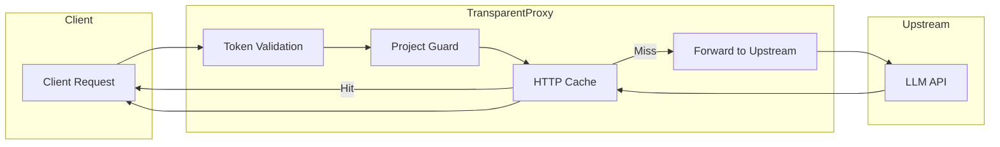
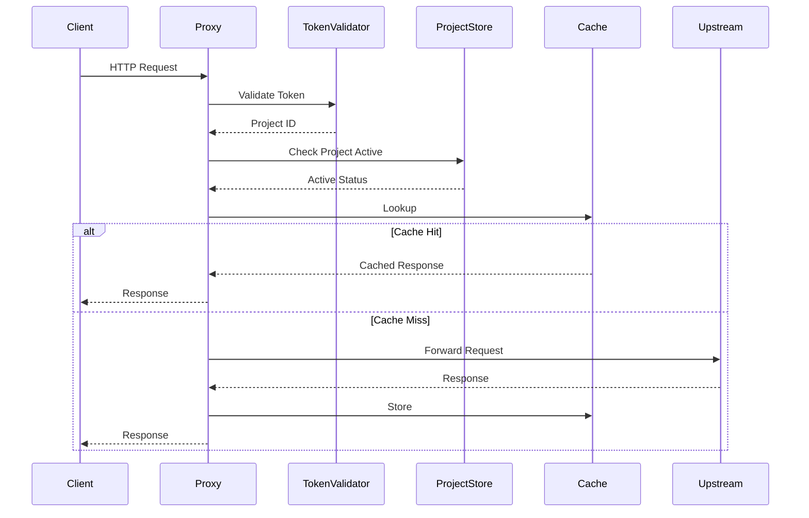
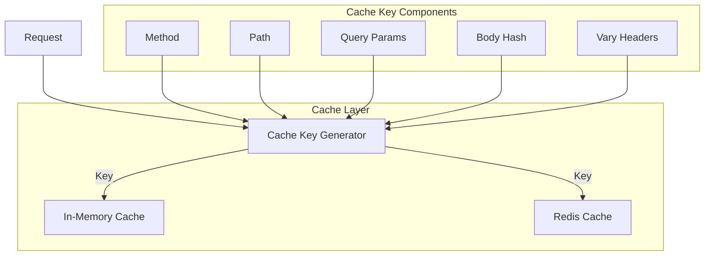

# Proxy Package

## Purpose & Responsibilities

The `proxy` package implements a transparent HTTP reverse proxy for LLM APIs. It handles:

- Transparent request forwarding to upstream APIs (OpenAI, Anthropic, etc.)
- Token-based authentication and authorization
- Request validation and endpoint whitelisting
- HTTP response caching (in-memory and Redis backends)
- Server-Sent Events (SSE) streaming support
- Metadata extraction from responses
- Observability event publishing

## Architecture

## Request Flow

## Key Types & Interfaces

| Type | Description |
|------|-------------|
| `TransparentProxy` | Main proxy implementation with caching and metrics |
| `ProxyConfig` | Configuration for proxy behavior |
| `ProxyMetrics` | Runtime metrics (requests, errors, cache stats) |
| `TokenValidator` | Interface for token validation |
| `ProjectStore` | Interface for project data access |
| `AuditLogger` | Interface for audit event logging |

### Constructor Functions

| Function | Description |
|----------|-------------|
| `NewTransparentProxy` | Creates proxy with default logger |
| `NewTransparentProxyWithLogger` | Creates proxy with custom logger |
| `NewTransparentProxyWithObservability` | Creates proxy with event bus integration |

## Streaming Support (SSE)

The proxy fully supports Server-Sent Events for streaming responses:

- Automatic detection of streaming requests via `Accept: text/event-stream`
- Proper header handling for SSE (`Cache-Control: no-cache`)
- Configurable flush interval for real-time streaming
- Response capture for streaming with size limits

## HTTP Caching

### Cache Backends

| Backend | Use Case | Configuration |
|---------|----------|---------------|
| In-Memory | Single instance, development | Default when `HTTPCacheEnabled: true` |
| Redis | Multi-instance, production | Set `RedisCacheURL` |

### Cache Metrics

The proxy exposes cache metrics via `Metrics()`:
- `CacheHits` - Responses served from cache
- `CacheMisses` - Responses fetched from upstream
- `CacheBypass` - Requests that bypassed cache
- `CacheStores` - Responses stored in cache

## Configuration

### Environment Variables

| Variable | Description |
|----------|-------------|
| `HTTP_CACHE_ENABLED` | Enable HTTP cache (`true`/`false`) |
| `HTTP_CACHE_BACKEND` | Cache backend (`redis` or in-memory) |
| `REDIS_ADDR` | Redis server address (shared with event bus) |
| `REDIS_DB` | Redis database number |
| `REDIS_CACHE_KEY_PREFIX` | Key prefix for Redis cache |

### ProxyConfig Options

| Field | Description | Default |
|-------|-------------|---------|
| `TargetBaseURL` | Upstream API base URL | Required |
| `AllowedEndpoints` | Whitelisted endpoint paths | Required |
| `AllowedMethods` | Whitelisted HTTP methods | Required |
| `RequestTimeout` | Max request duration | `120s` |
| `FlushInterval` | Streaming flush interval | `100ms` |
| `HTTPCacheEnabled` | Enable response caching | `false` |
| `EnforceProjectActive` | Require active project | `false` |

## Testing Guidance

- Use `httptest.NewServer` to mock upstream APIs
- Implement `TokenValidator` and `ProjectStore` interfaces for mocking
- See `proxy_test.go` for comprehensive test patterns
- Use in-memory cache for unit tests

## Troubleshooting

### Common Issues

| Symptom | Cause | Solution |
|---------|-------|----------|
| 401 Unauthorized | Invalid or expired token | Check token format and validity |
| 403 Forbidden | Project inactive or endpoint not allowed | Verify project status and AllowedEndpoints |
| 502 Bad Gateway | Upstream API unreachable | Check network and TargetBaseURL |
| 504 Gateway Timeout | Request exceeded timeout | Increase RequestTimeout |
| Cache not working | Cache disabled or misconfigured | Verify HTTPCacheEnabled and backend config |

### Debug Headers

| Header | Description |
|--------|-------------|
| `X-Request-ID` | Unique request identifier |
| `X-Cache-Status` | Cache hit/miss/bypass status |
| `X-Cache-Debug` | Additional cache debug info |
| `X-Upstream-Response-Time` | Upstream response time in ms |

## Related Packages

| Package | Relationship |
|---------|--------------|
| [`server`](../server/README.md) | Uses proxy as handler for API requests |
| [`token`](../token/README.md) | Token validation interface |
| [`database`](../database/README.md) | Project and token storage |
| [`middleware`](../middleware/) | Observability middleware integration |
| [`eventbus`](../eventbus/) | Event publishing for observability |
| [`audit`](../audit/) | Audit logging integration |

## Files

| File | Description |
|------|-------------|
| `proxy.go` | Main TransparentProxy implementation |
| `interfaces.go` | Interface definitions and ProxyConfig |
| `cache.go` | In-memory cache implementation |
| `cache_redis.go` | Redis cache implementation |
| `cache_helpers.go` | Cache key generation and helpers |
| `cache_stats.go` | Cache statistics aggregation |
| `stream_capture.go` | Streaming response capture |
| `config_schema.go` | API configuration loading |
| `project_guard.go` | Project active status enforcement |
| `circuitbreaker.go` | Circuit breaker for upstream failures |