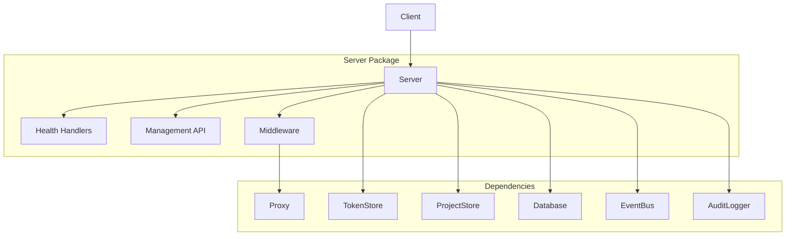
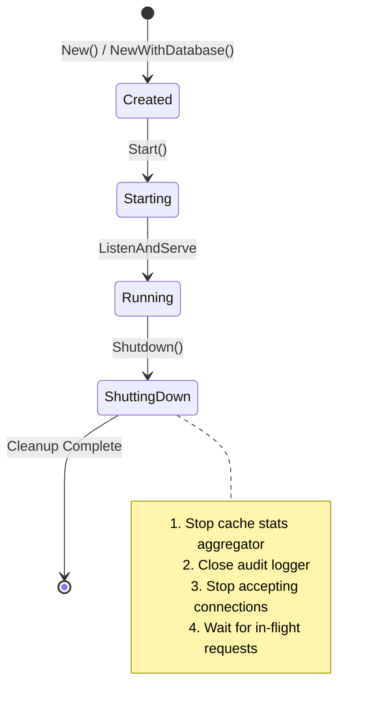

# Server Package

## Purpose & Responsibilities

The `server` package provides HTTP server lifecycle management for the LLM Proxy. It handles:

- HTTP server creation, configuration, and startup
- Graceful shutdown with resource cleanup
- Route registration for health, management, and proxy endpoints
- Management API endpoints for projects, tokens, and audit
- Request logging and middleware composition
- Integration with event bus, audit logging, and proxy components

## Architecture

## Key Types & Interfaces

| Type | Description |
|------|-------------|
| `Server` | Main HTTP server struct managing lifecycle, routes, and dependencies |
| `HealthResponse` | JSON response for health check endpoint |
| `Metrics` | Runtime metrics including request/error counts and start time |

### Constructor Functions

| Function | Description |
|----------|-------------|
| `New(cfg, tokenStore, projectStore)` | Creates server without database |
| `NewWithDatabase(cfg, tokenStore, projectStore, db)` | Creates server with database for audit logging |

## Server Lifecycle

## Configuration

The server accepts configuration via `config.Config`:

| Field | Description | Default |
|-------|-------------|---------|
| `ListenAddr` | Address to listen on | `:8080` |
| `RequestTimeout` | Maximum request duration | `30s` |
| `ManagementToken` | Token for management API auth | Required |
| `EnableMetrics` | Enable metrics endpoint | `false` |
| `MetricsPath` | Path for metrics endpoint | `/metrics` |
| `AuditEnabled` | Enable audit logging | `false` |
| `AuditLogFile` | Path to audit log file | - |
| `EventBusBackend` | Event bus type (`redis`, `in-memory`) | `in-memory` |

### Environment Variables

| Variable | Description |
|----------|-------------|
| `MANAGEMENT_TOKEN` | Token for management API authentication |
| `LISTEN_ADDR` | Server listen address |
| `HTTP_CACHE_ENABLED` | Enable HTTP cache (`true`/`false`) |
| `HTTP_CACHE_BACKEND` | Cache backend (`redis` or in-memory) |
| `REDIS_CACHE_URL` | Redis URL for cache |

## API Routes

### Health Endpoints

| Endpoint | Method | Description |
|----------|--------|-------------|
| `/health` | GET | Full health check with status and version |
| `/ready` | GET | Readiness probe for k8s |
| `/live` | GET | Liveness probe for k8s |

### Management API (requires `MANAGEMENT_TOKEN`)

| Endpoint | Method | Description |
|----------|--------|-------------|
| `/manage/projects` | GET, POST | List or create projects |
| `/manage/projects/{id}` | GET, PUT, DELETE | Project CRUD by ID |
| `/manage/tokens` | GET, POST | List or create tokens |
| `/manage/tokens/{id}` | GET, PUT, DELETE | Token CRUD by ID |
| `/manage/audit` | GET | Query audit events |
| `/manage/audit/{id}` | GET | Get audit event by ID |
| `/manage/cache/purge` | POST | Purge HTTP cache |

### Proxy Endpoint

All unmatched routes are handled by the transparent proxy, forwarding requests to the configured upstream API (e.g., OpenAI).

## Testing Guidance

- Use `httptest.NewServer` for integration tests
- Use in-memory database (`database.Config{Path: ":memory:"}`) for unit tests
- Mock `TokenStore` and `ProjectStore` interfaces for isolated testing
- See existing tests in `server_test.go` for patterns

## Troubleshooting

### Server Won't Start

| Symptom | Cause | Solution |
|---------|-------|----------|
| "address already in use" | Port conflict | Change `ListenAddr` or stop conflicting process |
| "failed to initialize logger" | Invalid log config | Check `LogLevel` and `LogFile` path |
| "failed to initialize audit logger" | Invalid audit path | Ensure `AuditLogFile` directory exists |
| "unknown event bus backend" | Invalid config | Use `redis` or `in-memory` |

### Management API Returns 401

- Ensure `MANAGEMENT_TOKEN` environment variable is set
- Include `Authorization: Bearer <token>` header in requests
- Token must match exactly (case-sensitive)

### Health Check Fails

- Check if the server started successfully (logs)
- Verify the listen address is accessible
- Check for database connectivity issues

### Slow Shutdown

- Increase shutdown timeout if requests need more time
- Check for stuck connections or long-running requests
- Review audit logger flush behavior

## Related Packages

| Package | Relationship |
|---------|--------------|
| [`proxy`](../proxy/README.md) | Transparent proxy handler for API requests |
| [`token`](../token/README.md) | Token validation for authentication |
| [`database`](../database/README.md) | Token and project storage |
| [`middleware`](../middleware/) | Request instrumentation and observability |
| [`eventbus`](../eventbus/) | Async event publishing |
| [`audit`](../audit/) | Audit event logging |
| [`config`](../config/) | Server configuration |
