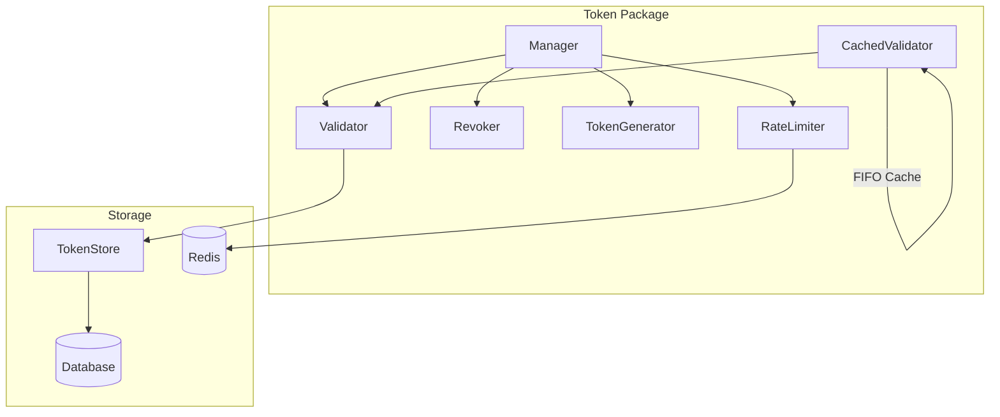
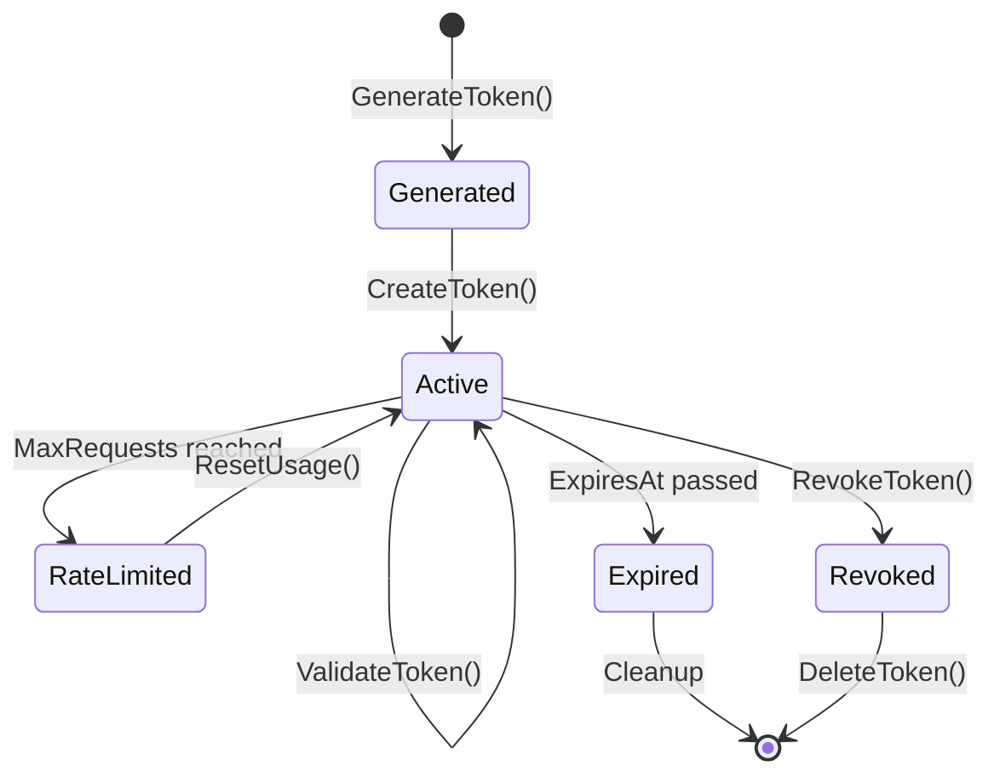
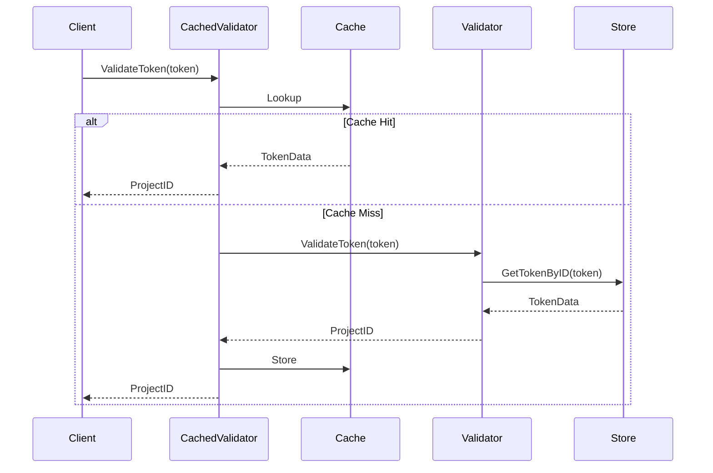
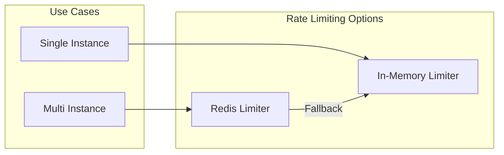

# Token Package

## Purpose & Responsibilities

The `token` package provides comprehensive token lifecycle management for the LLM Proxy. It handles:

- Secure token generation using UUIDv7 (time-ordered)
- Token validation with caching for performance
- Token expiration and automatic revocation
- Per-token rate limiting (in-memory and distributed)
- Usage tracking and statistics
- Token revocation (individual and bulk)

## Architecture

## Token Lifecycle

## Key Types & Interfaces

| Type | Description |
|------|-------------|
| `Manager` | Unified interface for all token operations |
| `TokenData` | Core token data structure with all properties |
| `TokenValidator` | Interface for token validation |
| `TokenStore` | Interface for token persistence |
| `CachedValidator` | Validator with in-memory caching |
| `Revoker` | Handles token revocation operations |
| `TokenGenerator` | Generates secure tokens with options |

### TokenData Properties

| Field | Type | Description |
|-------|------|-------------|
| `Token` | `string` | The token ID (`sk-...`) |
| `ProjectID` | `string` | Associated project ID |
| `ExpiresAt` | `*time.Time` | Expiration time (nil = no expiration) |
| `IsActive` | `bool` | Active status |
| `RequestCount` | `int` | Number of requests made |
| `MaxRequests` | `*int` | Maximum requests allowed (nil = unlimited) |
| `CacheHitCount` | `int` | Number of cache hits |

## Token Generation

Tokens use UUIDv7 which includes a timestamp component, making them time-ordered:

- Format: `sk-` prefix + base64url-encoded UUIDv7 (22 chars)
- Example: `sk-AYB2gH5xQZ1234567890ab`
- Benefits: Sortable by creation time, globally unique, URL-safe

## Validation Flow

### Validation Errors

| Error | Cause |
|-------|-------|
| `ErrTokenNotFound` | Token doesn't exist in store |
| `ErrTokenInactive` | Token has been deactivated |
| `ErrTokenExpired` | Token past expiration time |
| `ErrTokenRateLimit` | MaxRequests reached |
| `ErrInvalidTokenFormat` | Token string malformed |

## Rate Limiting

### Rate Limiter Types

| Type | Use Case | State |
|------|----------|-------|
| `MemoryRateLimiter` | Single instance | In-process |
| `RedisRateLimiter` | Multi-instance | Distributed |

See [Distributed Rate Limiting Documentation](../../docs/observability/distributed-rate-limiting.md) for more details.

## Configuration

### Cache Configuration

| Option | Description | Default |
|--------|-------------|---------|
| `TTL` | Time-to-live for cache entries | 5 minutes |
| `MaxSize` | Maximum number of cached entries | 1000 |
| `EnableCleanup` | Enable automatic cache cleanup | true |
| `CleanupInterval` | Interval between cleanup runs | 1 minute |

### Rate Limiter Configuration

| Option | Description | Default |
|--------|-------------|---------|
| `KeyPrefix` | Redis key prefix | `ratelimit:` |
| `DefaultWindowDuration` | Rate limit window | 1 minute |
| `DefaultMaxRequests` | Requests per window | 60 |
| `EnableFallback` | Fall back on Redis errors | true |

## Testing Guidance

- Implement `TokenStore` interface for mocking
- Use in-memory database for integration tests
- See `*_test.go` files for comprehensive test patterns
- Test error conditions: not found, inactive, expired, rate limited

## Troubleshooting

### Common Errors

| Error | Cause | Solution |
|-------|-------|----------|
| `ErrTokenNotFound` | Token doesn't exist | Verify token was created |
| `ErrTokenInactive` | Token deactivated | Check if token was revoked |
| `ErrTokenExpired` | Token past expiration | Create new token |
| `ErrTokenRateLimit` | MaxRequests reached | Increase limit or reset usage |
| `ErrInvalidTokenFormat` | Malformed token | Check prefix and length |

### Cache Issues

| Symptom | Cause | Solution |
|---------|-------|----------|
| Stale data after update | Cache TTL | Reduce TTL or clear cache |
| High memory usage | Large cache | Reduce MaxSize |
| Slow validation | Cache misses | Increase MaxSize or TTL |

### Rate Limiting Issues

| Symptom | Cause | Solution |
|---------|-------|----------|
| Inconsistent limits | In-memory limiter | Switch to Redis limiter |
| Redis errors | Connection issues | Enable fallback mode |
| Limit not enforced | MaxRequests is nil | Set MaxRequests on token |

## Related Packages

| Package | Relationship |
|---------|--------------|
| [`database`](../database/README.md) | Token persistence layer |
| [`proxy`](../proxy/README.md) | Uses TokenValidator interface |
| [`server`](../server/README.md) | Token management API |

## Files

| File | Description |
|------|-------------|
| `token.go` | Token generation and format validation |
| `validate.go` | StandardValidator implementation |
| `cache.go` | CachedValidator with FIFO cache |
| `manager.go` | Unified Manager interface |
| `ratelimit.go` | In-memory rate limiter |
| `redis_ratelimit.go` | Distributed Redis rate limiter |
| `redis_adapter.go` | Redis client adapter |
| `revoke.go` | Token revocation operations |
| `expiration.go` | Expiration checking and auto-revoke |
| `utils.go` | Helper functions (obfuscation, info) |
